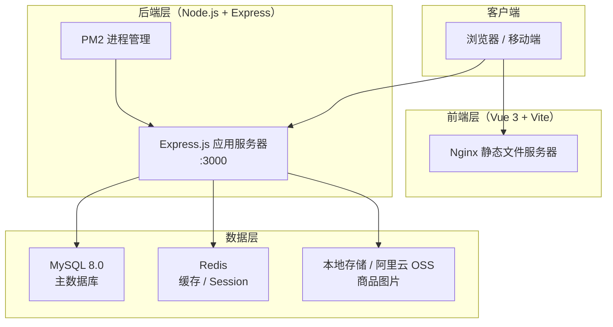
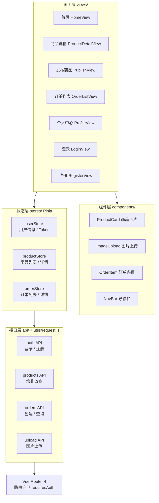
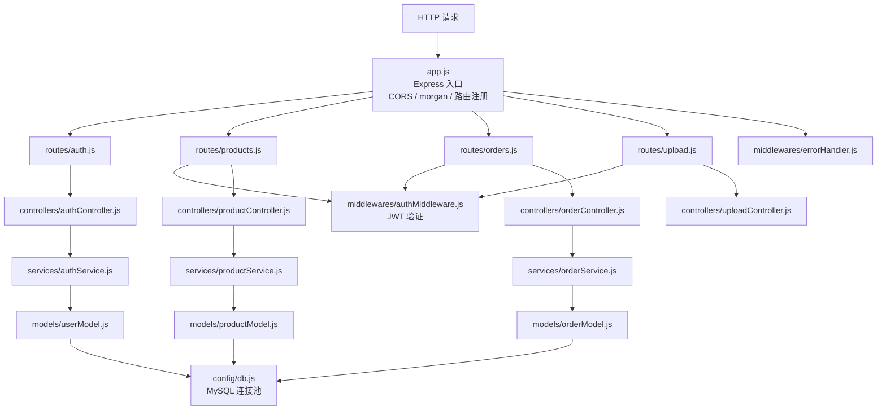
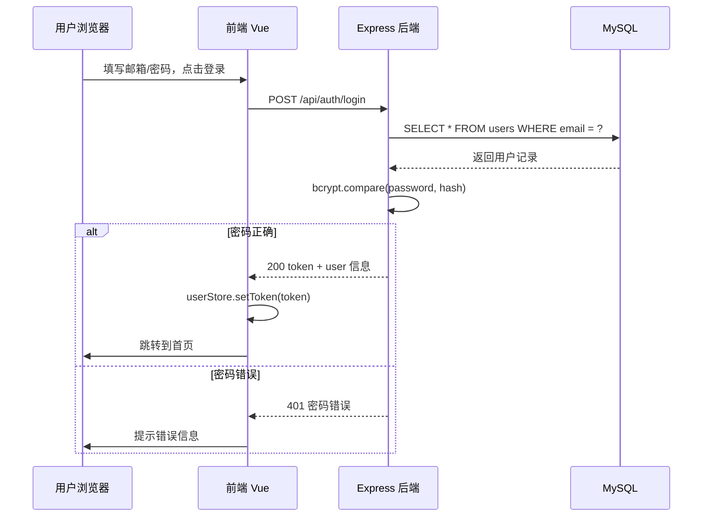
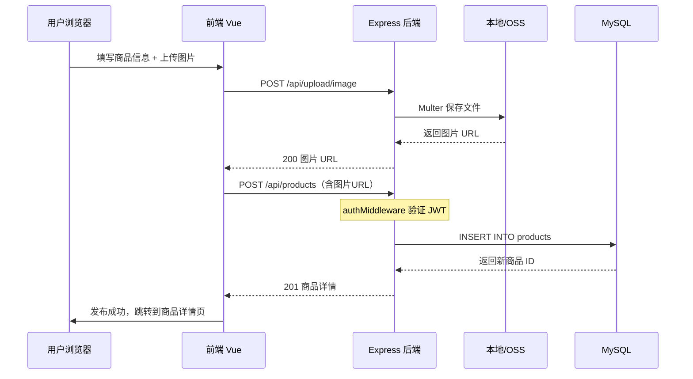
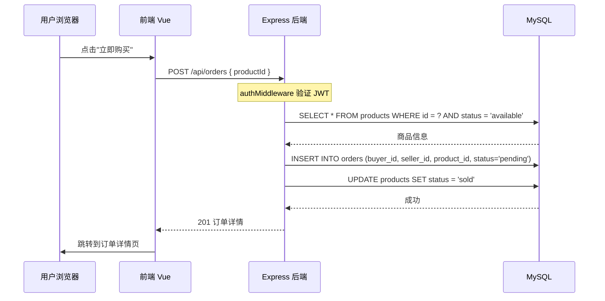

# 系统架构设计文档

**项目**：校园二手交易平台（Campus Trade）
**版本**：v1.0.0
**更新时间**：2026-03-25

---

## 1. 系统整体架构



---

## 2. 前端架构

### 2.1 层次结构



### 2.2 路由设计

| 路径 | 页面 | 是否需要登录 |
|------|------|-------------|
| `/` | 首页商品列表 | 否 |
| `/login` | 登录页 | 否 |
| `/register` | 注册页 | 否 |
| `/product/:id` | 商品详情页 | 否 |
| `/publish` | 发布商品页 | 是 |
| `/product/:id/edit` | 编辑商品页 | 是 |
| `/orders` | 订单列表页 | 是 |
| `/orders/:id` | 订单详情页 | 是 |
| `/profile` | 个人中心页 | 是 |
| `/my-products` | 我的商品页 | 是 |

---

## 3. 后端架构

### 3.1 模块划分



### 3.2 中间件链

```
请求 → CORS → morgan日志 → express.json() → 路由匹配
                                                   ↓
                                          authMiddleware（需鉴权路由）
                                                   ↓
                                              Controller
                                                   ↓
                                               Service
                                                   ↓
                                                Model
                                                   ↓
                                              MySQL / Redis
```

---

## 4. 数据库架构

详见 [docs/database.md](./database.md)

核心数据表：

- `users` — 用户账户信息
- `products` — 商品信息
- `orders` — 交易订单

---

## 5. 核心交互流程

### 5.1 用户登录流程



### 5.2 发布商品流程



### 5.3 创建订单流程



---

## 6. 技术选型汇总

| 层级 | 选择 | 版本 | 理由 |
|------|------|------|------|
| 前端框架 | Vue 3 | 3.x | 组合式 API，响应式设计友好 |
| 前端构建 | Vite | 5.x | 极快的 HMR，ES module 原生支持 |
| 前端 UI | Element Plus | 2.x | Vue 3 官方推荐，组件丰富 |
| 前端路由 | Vue Router | 4.x | 与 Vue 3 配套 |
| 前端状态 | Pinia | 2.x | 轻量，TypeScript 友好 |
| 后端框架 | Express.js | 4.x | 成熟稳定，生态丰富 |
| 后端运行时 | Node.js | 18 LTS | 长期支持版本 |
| 认证 | JWT | — | 无状态，前后端分离友好 |
| 主数据库 | MySQL | 8.0 | 关系型，事务支持，适合订单场景 |
| 缓存 | Redis | — | 高性能，用于热门商品缓存 |
| 文件上传 | Multer | — | Express 生态标准方案 |
| 部署 | PM2 + Nginx | — | 生产环境标准方案 |
