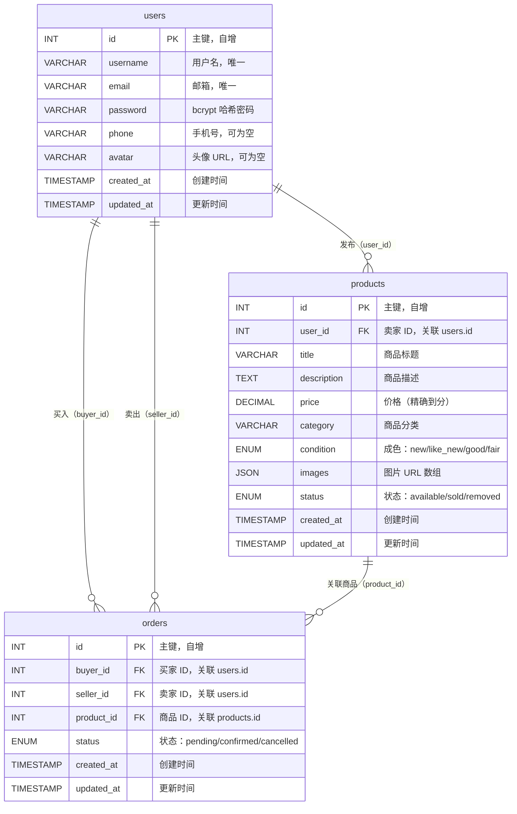

# 数据库设计文档

**项目**：校园二手交易平台（Campus Trade）
**数据库**：MySQL 8.0
**版本**：v1.0.0
**更新时间**：2026-03-25

---

## 1. ER 图



---

## 2. 数据表详细说明

### 2.1 用户表 `users`

| 字段 | 类型 | 约束 | 说明 |
|------|------|------|------|
| id | INT | PK, AUTO_INCREMENT | 主键 |
| username | VARCHAR(50) | UNIQUE, NOT NULL | 用户名 |
| email | VARCHAR(100) | UNIQUE, NOT NULL | 邮箱（登录账号） |
| password | VARCHAR(255) | NOT NULL | bcrypt 哈希密码 |
| phone | VARCHAR(20) | NULL | 手机号 |
| avatar | VARCHAR(500) | NULL | 头像图片 URL |
| created_at | TIMESTAMP | DEFAULT CURRENT_TIMESTAMP | 注册时间 |
| updated_at | TIMESTAMP | DEFAULT CURRENT_TIMESTAMP ON UPDATE | 更新时间 |

### 2.2 商品表 `products`

| 字段 | 类型 | 约束 | 说明 |
|------|------|------|------|
| id | INT | PK, AUTO_INCREMENT | 主键 |
| user_id | INT | FK → users.id, NOT NULL | 卖家 ID |
| title | VARCHAR(100) | NOT NULL | 商品标题 |
| description | TEXT | NULL | 商品详细描述 |
| price | DECIMAL(10,2) | NOT NULL | 价格（单位：元） |
| category | VARCHAR(50) | NOT NULL | 分类（书籍/数码/服装/其他） |
| condition | ENUM | NOT NULL | 成色：new/like_new/good/fair |
| images | JSON | NULL | 图片 URL 数组，最多 5 张 |
| status | ENUM | DEFAULT 'available' | available/sold/removed |
| created_at | TIMESTAMP | DEFAULT CURRENT_TIMESTAMP | 发布时间 |
| updated_at | TIMESTAMP | DEFAULT CURRENT_TIMESTAMP ON UPDATE | 更新时间 |

### 2.3 订单表 `orders`

| 字段 | 类型 | 约束 | 说明 |
|------|------|------|------|
| id | INT | PK, AUTO_INCREMENT | 主键 |
| buyer_id | INT | FK → users.id, NOT NULL | 买家 ID |
| seller_id | INT | FK → users.id, NOT NULL | 卖家 ID |
| product_id | INT | FK → products.id, NOT NULL | 商品 ID |
| status | ENUM | DEFAULT 'pending' | pending/confirmed/cancelled |
| created_at | TIMESTAMP | DEFAULT CURRENT_TIMESTAMP | 下单时间 |
| updated_at | TIMESTAMP | DEFAULT CURRENT_TIMESTAMP ON UPDATE | 更新时间 |

---

## 3. 建表 SQL

```sql
-- 创建数据库
CREATE DATABASE IF NOT EXISTS campus_trade
  DEFAULT CHARACTER SET utf8mb4
  DEFAULT COLLATE utf8mb4_unicode_ci;

USE campus_trade;

-- =====================
-- 用户表
-- =====================
CREATE TABLE IF NOT EXISTS users (
  id         INT           NOT NULL AUTO_INCREMENT,
  username   VARCHAR(50)   NOT NULL,
  email      VARCHAR(100)  NOT NULL,
  password   VARCHAR(255)  NOT NULL,
  phone      VARCHAR(20)   NULL,
  avatar     VARCHAR(500)  NULL,
  created_at TIMESTAMP     NOT NULL DEFAULT CURRENT_TIMESTAMP,
  updated_at TIMESTAMP     NOT NULL DEFAULT CURRENT_TIMESTAMP ON UPDATE CURRENT_TIMESTAMP,
  PRIMARY KEY (id),
  UNIQUE KEY uq_users_email    (email),
  UNIQUE KEY uq_users_username (username)
) ENGINE=InnoDB DEFAULT CHARSET=utf8mb4 COLLATE=utf8mb4_unicode_ci;

-- =====================
-- 商品表
-- =====================
CREATE TABLE IF NOT EXISTS products (
  id          INT             NOT NULL AUTO_INCREMENT,
  user_id     INT             NOT NULL,
  title       VARCHAR(100)    NOT NULL,
  description TEXT            NULL,
  price       DECIMAL(10, 2)  NOT NULL,
  category    VARCHAR(50)     NOT NULL,
  `condition` ENUM('new', 'like_new', 'good', 'fair') NOT NULL,
  images      JSON            NULL,
  status      ENUM('available', 'sold', 'removed') NOT NULL DEFAULT 'available',
  created_at  TIMESTAMP       NOT NULL DEFAULT CURRENT_TIMESTAMP,
  updated_at  TIMESTAMP       NOT NULL DEFAULT CURRENT_TIMESTAMP ON UPDATE CURRENT_TIMESTAMP,
  PRIMARY KEY (id),
  KEY idx_products_user_id  (user_id),
  KEY idx_products_status   (status),
  KEY idx_products_category (category),
  CONSTRAINT fk_products_user FOREIGN KEY (user_id) REFERENCES users (id) ON DELETE CASCADE
) ENGINE=InnoDB DEFAULT CHARSET=utf8mb4 COLLATE=utf8mb4_unicode_ci;

-- =====================
-- 订单表
-- =====================
CREATE TABLE IF NOT EXISTS orders (
  id         INT  NOT NULL AUTO_INCREMENT,
  buyer_id   INT  NOT NULL,
  seller_id  INT  NOT NULL,
  product_id INT  NOT NULL,
  status     ENUM('pending', 'confirmed', 'cancelled') NOT NULL DEFAULT 'pending',
  created_at TIMESTAMP NOT NULL DEFAULT CURRENT_TIMESTAMP,
  updated_at TIMESTAMP NOT NULL DEFAULT CURRENT_TIMESTAMP ON UPDATE CURRENT_TIMESTAMP,
  PRIMARY KEY (id),
  KEY idx_orders_buyer_id   (buyer_id),
  KEY idx_orders_seller_id  (seller_id),
  KEY idx_orders_product_id (product_id),
  CONSTRAINT fk_orders_buyer   FOREIGN KEY (buyer_id)   REFERENCES users    (id) ON DELETE RESTRICT,
  CONSTRAINT fk_orders_seller  FOREIGN KEY (seller_id)  REFERENCES users    (id) ON DELETE RESTRICT,
  CONSTRAINT fk_orders_product FOREIGN KEY (product_id) REFERENCES products (id) ON DELETE RESTRICT
) ENGINE=InnoDB DEFAULT CHARSET=utf8mb4 COLLATE=utf8mb4_unicode_ci;
```

---

## 4. 索引设计说明

| 表 | 索引 | 字段 | 用途 |
|----|------|------|------|
| users | uq_users_email | email | 登录时查询，唯一约束 |
| users | uq_users_username | username | 用户名唯一约束 |
| products | idx_products_user_id | user_id | 查询某用户发布的商品 |
| products | idx_products_status | status | 按状态筛选商品列表 |
| products | idx_products_category | category | 按分类筛选商品 |
| orders | idx_orders_buyer_id | buyer_id | 查询买家的订单列表 |
| orders | idx_orders_seller_id | seller_id | 查询卖家的订单列表 |
| orders | idx_orders_product_id | product_id | 查询商品的订单记录 |

---

## 5. 业务规则约束

1. **商品状态流转**：`available` → `sold`（成交）或 `available` → `removed`（卖家下架）
2. **订单状态流转**：`pending` → `confirmed`（买家确认收货）或 `pending` → `cancelled`（任一方取消）
3. **一商品一订单**：同一 `product_id` 在 `pending` 状态只允许存在一条订单
4. **密码安全**：`password` 字段只存 bcrypt 哈希值，长度固定为 60 字符
5. **图片限制**：`images` JSON 数组最多 5 个 URL，单图文件大小上限 5MB（由后端 Multer 控制）
