# 校园二手交易平台（Campus Trade）项目报告

项目名称：校园二手交易平台（Campus Trade）

报告形式：Markdown 项目文档

小组成员：王勇、马俊琛

报告日期：2026 年 6 月

---

## 一、项目简介

校园二手交易平台是一套面向在校学生的二手物品流转系统，主要解决校园内闲置物品交易信息分散、发布成本高、买卖双方沟通入口不统一等问题。项目围绕学生真实使用场景设计，支持商品发布、商品浏览、分类筛选、关键词搜索、商品详情查看、图片上传、订单管理、个人中心和 AI 辅助发布等功能。

项目不是单纯的静态展示页面，而是一个前后端分离的完整 Web 应用。前端负责页面展示、用户交互、路由跳转、状态管理和接口调用；后端负责身份认证、业务接口、数据库读写、文件上传、AI 服务调用和统一错误处理；数据库负责保存用户、商品、订单等核心业务数据；部署层面使用 Docker Compose 管理前端、后端和 MySQL 服务。

本项目的目标是完成一个可运行、可测试、可部署、可演示的校园交易平台。除了基本业务功能外，项目还补充了测试覆盖率、CI、Codecov、Docker 镜像、演示视频和项目文档，使它具备较完整的软件工程交付形态。

---

## 二、项目目标与应用场景

项目面向在校大学生，尤其适合毕业季物品转让、开学季二手教材购买、宿舍生活用品流转、数码设备交易等场景。

主要目标包括：

1. 为学生提供统一的校园二手商品信息入口，减少微信群、朋友圈等零散渠道的信息遗漏。
2. 支持卖家快速发布商品，填写标题、价格、分类、成色、描述并上传图片。
3. 支持买家按分类、关键词、状态和排序方式浏览商品。
4. 支持商品详情展示，包括图片、价格、描述、卖家信息和购买入口。
5. 支持订单记录，让交易从“看见商品”进一步形成可追踪的交易流程。
6. 通过 AI 文案和 AI 定价功能降低商品发布门槛。
7. 通过测试、CI、容器化部署和文档提升项目的可维护性与可交付性。

---

## 三、系统架构

项目采用前后端分离架构，整体可以分为前端层、接口层、后端业务层、数据层、部署层和测试保障层。

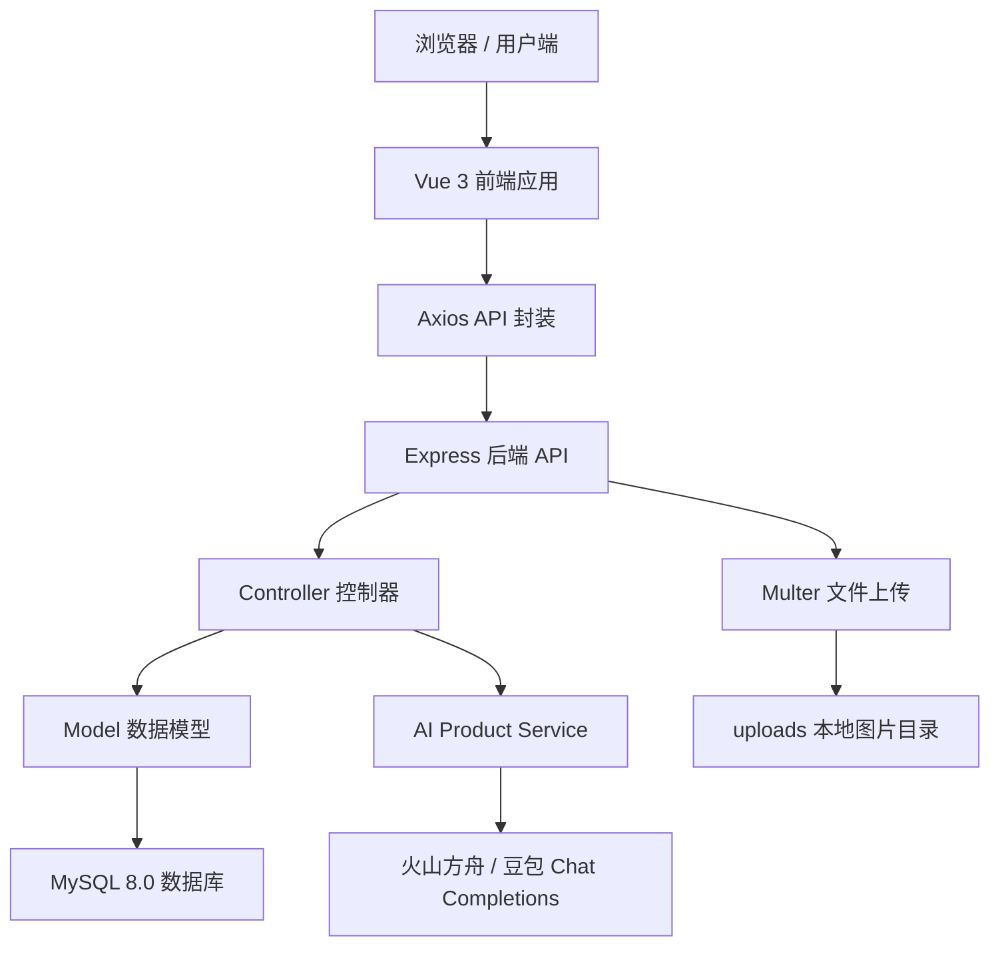

### 3.1 架构分层

| 层级 | 技术 / 文件 | 主要职责 |
|---|---|---|
| 前端层 | Vue 3、Vite、Element Plus、Pinia、Vue Router | 商品浏览、发布、登录、个人中心、订单页面和交互状态管理 |
| 接口层 | `frontend/src/api/index.js`、`frontend/src/utils/request.js` | 封装 Axios、统一 API 调用、自动携带 JWT 和 CSRF token |
| 后端路由层 | `backend/src/routes/*.js` | 注册 `/api/auth`、`/api/products`、`/api/orders`、`/api/upload` |
| 控制器层 | `backend/src/controllers/*.js` | 解析请求、校验参数、组织响应 |
| 模型层 | `backend/src/models/*.js` | 使用 `mysql2/promise` 执行 SQL 和事务 |
| AI 服务层 | `backend/src/services/aiProductService.js` | 对接豆包模型，生成商品文案和价格建议 |
| 数据层 | MySQL 8.0 | 保存用户、商品、订单等结构化数据 |
| 部署层 | `compose.yaml`、`compose.prod.yaml`、Dockerfile | 开发/生产环境容器编排、镜像构建、健康检查 |

---

## 四、前端说明

前端位于 `frontend/` 目录，使用 Vue 3 + Vite 构建。前端不是简单页面堆叠，而是按“页面层、组件层、接口层、状态层、工具层”组织。页面组件集中在 `frontend/src/views/`，可复用组件集中在 `frontend/src/components/`，业务接口集中在 `frontend/src/api/index.js`，统一请求逻辑集中在 `frontend/src/utils/request.js`，登录态由 `frontend/src/stores/user.js` 管理。

### 4.1 前端技术栈

| 技术 | 作用 |
|---|---|
| Vue 3 | 使用组合式 API 开发页面和组件，表单、列表、弹窗、按钮状态都通过响应式变量驱动 |
| Vite 5 | 提供开发服务器、热更新和生产构建，开发时可通过 Docker Compose 挂载源码热重载 |
| Element Plus | 用于表单、输入框、按钮、分页、上传、标签、消息提示等通用 UI 能力 |
| Vue Router 4 | 管理首页、详情、发布、订单、个人中心等路由，并通过 `meta.requiresAuth` 做访问控制 |
| Pinia 2 | 管理用户 token 和用户信息，页面刷新后从 localStorage 恢复登录态 |
| Axios | 封装 HTTP 请求，统一 baseURL、超时、JWT 请求头、CSRF 请求头和 401 错误处理 |
| Vitest | 前端组件测试、API mock 测试和覆盖率统计 |

### 4.2 前端目录与职责

| 目录 / 文件 | 职责 |
|---|---|
| `src/main.js` | 创建 Vue 应用，注册 Pinia、Vue Router、Element Plus 和全局样式 |
| `src/App.vue` | 根组件，负责挂载公共布局和 `<router-view>` |
| `src/router/index.js` | 定义路由表和登录守卫 |
| `src/api/index.js` | 按 auth、products、orders、upload 模块封装接口 |
| `src/utils/request.js` | 创建 Axios 实例，集中处理 token、CSRF、错误跳转 |
| `src/stores/user.js` | 保存 token、用户信息，并封装设置 token、清除 token、获取用户信息方法 |
| `src/components/` | 存放 AppHeader、ProductCard、ImageUploader 等复用组件 |
| `src/views/` | 存放首页、详情、发布、订单、个人中心等页面级组件 |

这种分层的结果是页面代码不直接散落请求细节。比如发布页只调用 `products.create()` 或 `products.generate()`，不需要知道请求基地址和 token 如何附加；商品卡片只负责展示数据和触发事件，不负责列表接口。

### 4.3 前端路由与登录守卫

路由使用 `createRouter` 和 `createWebHistory` 创建。公开页面包括首页、登录、注册、商品详情；需要登录的页面通过 `meta: { requiresAuth: true }` 标记，例如 `/publish`、`/orders`、`/profile`、`/my-products`、`/product/:id/edit`。

核心守卫逻辑如下：

```js
router.beforeEach((to) => {
  if (to.meta.requiresAuth && !localStorage.getItem('token')) {
    return '/login'
  }
})
```

实现结果是：未登录用户可以浏览首页和商品详情，但不能发布商品、查看订单或进入个人中心。这样既保证了商品浏览的开放性，也保护了交易和个人数据相关页面。

### 4.4 前端核心页面

| 页面 | 文件 | 功能说明 |
|---|---|---|
| 首页商品列表 | `HomeView.vue` | 展示商品卡片、分类筛选、排序、分页、空状态和加载状态 |
| 商品详情 | `ProductDetailView.vue` | 展示商品图片、标题、价格、描述、卖家信息和购买入口 |
| 发布商品 | `PublishView.vue` | 商品表单、图片上传、AI 文案生成、AI 定价、提交发布 |
| 登录注册 | `LoginView.vue`、`RegisterView.vue` | 登录、注册、表单校验、登录态保存 |
| 个人中心 | `ProfileView.vue` | 展示用户信息、我的商品、我的订单、账户设置 |
| 我的商品 | `MyProductsView.vue` | 查看和管理当前用户发布的商品 |
| 订单页面 | `OrderListView.vue`、`OrderDetailView.vue` | 展示订单列表和订单详情 |
| 编辑商品 | `EditProductView.vue` | 商品内容回显和修改 |

页面实现上，首页负责组装筛选条件并调用商品列表接口；商品详情页根据路由参数读取商品 ID，再加载商品详情；发布页负责表单校验、图片上传、AI 文案生成、AI 定价和最终提交；个人中心和我的商品页面根据当前登录用户加载自己的数据；订单页面区分买家和卖家的交易视角。

### 4.5 前端核心组件

| 组件 | 文件 | 具体作用 |
|---|---|---|
| 顶部导航栏 | `AppHeader.vue` | Logo、搜索框、发布商品入口、用户菜单 |
| 商品卡片 | `ProductCard.vue` | 展示图片、标题、价格、卖家、发布时间、状态标签 |
| 图片上传 | `ImageUploader.vue` | 支持多图上传、预览、删除、大小和类型校验 |

组件设计的目标是复用核心交互。`AppHeader` 出现在主要页面顶部，统一承载搜索和发布入口；`ProductCard` 在首页、收藏、我的商品等场景复用，通过 props 控制是否显示编辑/删除等操作；`ImageUploader` 统一处理文件选择、预览、删除、上传接口调用和 `v-model` 回填，避免每个页面重复写上传逻辑。

### 4.6 前端请求封装与 API 模块

前端通过 `frontend/src/api/index.js` 统一封装接口：

```js
export const products = {
  getList: (params) => request.get('/products', { params }),
  getDetail: (id) => request.get(`/products/${id}`),
  create: (data) => request.post('/products', data),
  generate: (data) => request.post('/products/generate', data),
  update: (id, data) => request.put(`/products/${id}`, data),
  remove: (id) => request.delete(`/products/${id}`),
  getMine: (params = {}) => request.get('/products/my', { params }),
}
```

API 文件按模块导出：

| 模块 | 方法举例 | 作用 |
|---|---|---|
| `auth` | `register`、`login`、`getMe`、`updatePassword` | 用户注册、登录、获取当前用户、修改密码 |
| `products` | `getList`、`getDetail`、`create`、`generate`、`update`、`remove`、`getMine` | 商品列表、详情、发布、AI 生成、编辑、删除、我的商品 |
| `orders` | `create`、`getList`、`getDetail`、`confirm`、`cancel` | 创建订单、查询订单、确认订单、取消订单 |
| `upload` | `image` | 使用 `multipart/form-data` 上传商品图片 |

`request.js` 中创建 Axios 实例，默认 API 地址为：

```js
baseURL: import.meta.env.VITE_API_BASE_URL || 'http://localhost:3001/api'
```

请求拦截器会自动从 `localStorage` 读取 token，并加到请求头：

```http
Authorization: Bearer <token>
```

对 `POST`、`PUT`、`DELETE` 请求，还会附加 `X-CSRF-Token`。响应拦截器会统一处理 `401`，清理本地 token 并跳转登录页。

技术细节包括：

1. 请求超时时间设置为 10 秒，避免接口无响应时页面一直等待。
2. JWT 从 `localStorage.getItem('token')` 读取，统一写入 `Authorization` 请求头。
3. CSRF token 保存在 `sessionStorage` 中，只对修改类请求附加。
4. 响应成功时统一返回 `response.data`，页面拿到的就是后端 `{ code, message, data }` 结构。
5. 响应为 401 时清除本地 token 和 CSRF token，并跳转登录页，避免继续使用失效登录态。

### 4.7 Pinia 登录态管理

用户状态由 `useUserStore` 管理，核心状态包括：

```js
const token = ref(localStorage.getItem('token') || '')
const userInfo = ref(null)
```

登录成功后调用 `setToken(newToken, user)`，同时更新响应式状态和 localStorage；退出或 token 失效时调用 `clearToken()`，清空状态和本地存储；需要刷新用户信息时调用 `fetchUserInfo()` 请求 `auth.getMe()`。

实现结果是：页面刷新后 token 不会立即丢失，路由守卫仍能识别登录状态；需要展示用户头像、用户名、个人中心信息时，也可以从 store 中读取或重新请求。

### 4.8 AI 结果回填前端表单

发布页的 AI 功能通过 `products.generate()` 调用后端 `/api/products/generate`。前端传入当前表单内容，包括标题、分类、成色、价格、描述和图片 URL。后端返回后，前端把结果写回响应式表单：

```js
form.description = suggestion.description
form.price = suggestion.price
```

因为页面输入框使用 `v-model` 绑定表单对象，`form.description` 和 `form.price` 更新后，文本框和价格输入框会自动刷新。这就是“AI 文案填到前端”的实现方式。

### 4.9 前端安全与兼容处理

前端安全主要体现在三处：

1. 登录态由 JWT 控制，未登录不能访问发布、订单、个人中心等页面。
2. Axios 对修改类请求增加 `X-CSRF-Token`，为后端验证 CSRF 留出接口。
3. 图片和头像 URL 使用安全 URL 处理逻辑，避免 `javascript:`、`data:` 等危险协议进入 `src` 或 `href` 属性。

资源路径兼容方面，上传接口返回 `/uploads/...` 相对路径，前端可以根据当前访问环境拼接完整地址，避免在代码中硬编码 `localhost`。

---

## 五、后端说明

后端位于 `backend/` 目录，使用 Node.js + Express 实现。入口文件为 `backend/src/app.js`。后端主要负责接口路由、身份认证、业务校验、数据库操作、文件上传、AI 服务调用、统一错误处理、健康检查和基础监控。

### 5.1 后端技术栈

| 技术 | 作用 |
|---|---|
| Node.js 18 | 后端运行环境 |
| Express 4 | Web API 框架 |
| mysql2/promise | MySQL 连接池和异步 SQL 操作 |
| jsonwebtoken | JWT 登录认证 |
| bcryptjs | 密码哈希 |
| multer | 商品图片上传 |
| dotenv | 环境变量管理 |
| morgan | 请求日志 |
| Jest + Supertest | 后端单元测试和接口集成测试 |

### 5.2 后端目录与模块划分

| 模块 | 文件 | 实现内容 |
|---|---|---|
| 应用入口 | `app.js` | 注册中间件、静态资源、路由和错误处理 |
| 用户认证 | `authController.js`、`routes/auth.js` | 注册、登录、获取当前用户、修改密码 |
| 商品管理 | `productsController.js`、`productModel.js` | 商品列表、详情、发布、更新、删除、我的商品 |
| 订单管理 | `ordersController.js`、`orderModel.js` | 创建订单、订单列表、订单详情、确认订单、取消订单 |
| 图片上传 | `uploadController.js`、`routes/upload.js` | 使用 Multer 接收图片并返回 `/uploads/...` 路径 |
| 中间件 | `authMiddleware.js`、`errorHandler.js`、`loginLimitMiddleware.js` | JWT 校验、统一错误响应、登录失败限制 |
| AI 服务 | `aiProductService.js` | 调用豆包模型生成商品文案和定价建议 |

后端采用 routes、controllers、models 分层：routes 只负责路由和中间件挂载；controllers 负责参数校验、权限判断和业务流程组织；models 负责 SQL 和数据格式转换。这样做的结果是接口入口、业务逻辑和数据库操作不会混在同一个文件里，便于测试和维护。

### 5.3 Express 应用入口与中间件链

`app.js` 中先加载环境变量，再创建 Express 实例，然后按顺序注册中间件：

```js
app.use(cors())
app.use(morgan('dev'))
app.use(express.json())
app.use(express.urlencoded({ extended: true }))
app.use('/uploads', express.static('uploads'))
```

其中 `cors()` 处理跨域，`morgan('dev')` 输出开发请求日志，`express.json()` 和 `express.urlencoded()` 解析请求体，`express.static('uploads')` 暴露本地上传图片。路由注册完成后，最后挂载统一错误处理中间件：

```js
app.use(errorHandler)
```

这种顺序保证了请求先经过通用解析，再进入业务路由；业务中抛出的异常最后统一交给 `errorHandler` 输出固定格式。

### 5.4 后端路由结构

后端在 `app.js` 中注册路由：

```js
app.use('/api/auth', authRoutes)
app.use('/api/products', productRoutes)
app.use('/api/orders', orderRoutes)
app.use('/api/upload', uploadRoutes)
```

常用接口包括：

| 接口 | 方法 | 功能 |
|---|---|---|
| `/api/auth/register` | POST | 用户注册 |
| `/api/auth/login` | POST | 用户登录 |
| `/api/auth/me` | GET | 获取当前用户 |
| `/api/products` | GET | 获取商品列表 |
| `/api/products/:id` | GET | 获取商品详情 |
| `/api/products` | POST | 发布商品 |
| `/api/products/generate` | POST | AI 生成商品文案/定价 |
| `/api/products/my` | GET | 获取我的商品 |
| `/api/orders` | POST | 创建订单 |
| `/api/orders` | GET | 获取订单列表 |
| `/api/upload/image` | POST | 上传商品图片 |

### 5.5 认证与权限控制

认证模块位于 `authController.js`。注册时先检查邮箱、密码、用户名是否为空，再检查邮箱和用户名是否重复，密码使用 bcryptjs 哈希后写入数据库：

```js
const hashedPassword = await bcryptjs.hash(password, 10)
```

登录时支持邮箱或用户名登录。控制器先根据输入判断是邮箱还是用户名，再查询用户并使用 bcryptjs 比对密码。登录成功后签发 JWT：

```js
const token = jwt.sign({ id: user.id, email: user.email }, process.env.JWT_SECRET, {
  expiresIn: '7d',
})
```

需要登录的接口使用 `authMiddleware`。中间件读取请求头 `Authorization`，要求格式为 `Bearer <token>`；验证成功后把解析出的用户信息写入 `req.user`，后续控制器通过 `req.user.id` 判断当前用户身份。

权限控制结果包括：

1. 未带 token 或 token 过期时返回 401。
2. 发布商品、我的商品、订单、上传图片、AI 生成等接口必须登录。
3. 修改和删除商品时检查 `product.seller.id === req.user.id`。
4. 查看订单时只允许订单买家或卖家访问。
5. 确认订单只允许卖家操作，取消订单允许买家或卖家操作。

### 5.6 商品模块实现细节

商品列表接口支持分页、搜索、分类、价格范围、状态和排序。控制器从 `req.query` 读取参数，并做基本清洗：

```js
page: Math.max(1, parseInt(page))
pageSize: Math.max(1, Math.min(100, parseInt(pageSize)))
sortOrder: sortOrder.toUpperCase() === 'ASC' ? 'ASC' : 'DESC'
```

`productModel.findAll()` 负责动态拼接 WHERE 条件，但所有用户输入都通过参数化查询传入，避免 SQL 注入。排序字段使用白名单：

```js
const allowedSortFields = ['created_at', 'price', 'title']
const safeSortBy = allowedSortFields.includes(sortBy) ? sortBy : 'created_at'
```

商品查询时会 JOIN users 表，把卖家信息一起返回；图片字段存储在 MySQL JSON 字段中，查询后通过 `JSON.parse` 转换为数组；价格统一转成数字；返回字段整理成前端更容易使用的结构：

```js
{
  id,
  title,
  price,
  images,
  seller: { id, username, avatar },
  createdAt
}
```

商品创建时检查标题、价格、分类、成色和图片数量，最多允许 5 张图片。删除商品采用软删除，把状态更新为 `removed`，这样历史订单仍然能关联原商品，不会因为物理删除造成数据断裂。

### 5.7 订单模块与事务处理

订单模块最重要的是保证“创建订单”和“商品状态更新”一致。创建订单时，控制器会从连接池获取连接并开启事务：

```js
const connection = await pool.getConnection()
await connection.beginTransaction()
```

随后通过 `orderModel.checkProductAvailability(productId, connection)` 查询商品，并使用：

```sql
SELECT id, user_id, status FROM products WHERE id = ? FOR UPDATE
```

`FOR UPDATE` 会在事务内锁定商品行，避免两个买家同时购买同一个商品。检查通过后先插入订单，再把商品状态更新为 `sold`，最后提交事务。如果任意步骤失败，则回滚事务。

取消订单也使用事务：先把订单状态改为 `cancelled`，再把商品状态恢复为 `available`。这样订单状态和商品状态始终同步，避免出现“订单取消但商品仍显示已售出”的问题。

### 5.8 图片上传实现细节

上传接口位于 `routes/upload.js` 和 `uploadController.js`。路由层使用 multer：

```js
router.post('/image', authMiddleware, upload.single('file'), uploadController.uploadImage)
```

multer 使用磁盘存储，将文件保存到 `backend/uploads`。文件过滤器同时检查扩展名和 MIME 类型，只允许 jpg、jpeg、png、gif；文件大小限制为 5MB。控制器中再次校验 MIME 类型、文件大小和最终路径：

```js
const uploadedFilePath = path.resolve(req.file.path)
const allowedDir = path.resolve(uploadsDir)
if (!uploadedFilePath.startsWith(allowedDir)) {
  fs.unlinkSync(req.file.path)
  return res.status(400).json(...)
}
```

通过 `path.resolve` 校验文件必须位于 uploads 目录内，可以降低路径遍历风险。接口最终返回相对 URL：

```json
{
  "url": "/uploads/product_xxx.jpg",
  "filename": "product_xxx.jpg"
}
```

这样前端和生产环境不需要依赖硬编码的 `localhost`。

### 5.9 AI 服务实现细节

AI 服务位于 `backend/src/services/aiProductService.js`。接口由 `/api/products/generate` 暴露，路由层要求登录。控制器校验 `generationType` 只能是 `description` 或 `price`，图片数量不能超过 5 张，然后调用 `generateProductSuggestion()`。

服务层会构造中文 prompt，要求模型只返回 JSON：

```json
{"description":"...","price":123}
```

如果传入了上传图片，服务会读取第一张 `/uploads/...` 图片，校验路径不能包含 `..`，限制图片最大 4MB，然后转成 base64 data URL，以 `image_url` 形式放入 Chat Completions 消息。调用模型时读取环境变量：

```text
ARK_API_KEY
ARK_MODEL
ARK_BASE_URL
```

默认模型为 `doubao-seed-2-0-mini-260215`。调用设置 20 秒超时，返回后从模型文本中提取 JSON，校验 `description` 非空、`price` 为正数，并把描述截断到 500 字以内。这样可以防止模型返回 Markdown 或无效格式直接污染前端表单。

### 5.10 统一错误处理与安全策略

后端控制器中大部分异常都通过 `next(error)` 交给 `errorHandler`。错误处理中间件统一返回：

```json
{
  "code": 500,
  "message": "服务器内部错误，请稍后重试",
  "data": null
}
```

在开发环境可以暴露具体错误信息，生产环境则按状态码返回通用提示，避免数据库错误、堆栈信息或内部路径泄露。对于 500 以上错误，会输出带时间戳的错误日志，便于排查。

安全方面，后端主要做了以下处理：

1. 密码只保存 bcrypt 哈希。
2. JWT 密钥从环境变量读取。
3. 所有 SQL 使用参数化查询。
4. 动态排序字段使用白名单。
5. 商品编辑、删除和订单操作做资源归属检查。
6. 上传文件检查类型、大小和路径。
7. 登录失败记录与限频逻辑通过中间件提供。

### 5.11 健康检查与监控接口

后端提供 `/health` 和 `/api/health`，用于 Docker 健康检查和人工验收；还提供 `/metrics` 指标接口，用于展示运行时长、请求总数、错误数量、错误率、平均响应时间和活动请求数。结构化日志记录请求时间、路径、状态码和响应耗时。监控内容在第十一章有截图和详细说明。

---

## 六、数据库设计

项目使用 MySQL 8.0 作为主数据库，通过 `mysql2/promise` 创建连接池。数据库设计围绕“用户发布商品、买家购买商品、订单记录交易”三条主线展开，核心表包括 `users`、`products`、`orders`。数据库脚本位于 `backend/src/scripts/init-db.sql`，测试数据位于 `backend/src/scripts/seed-data.sql`。

数据库连接配置由环境变量控制：

```js
const pool = mysql.createPool({
  host: process.env.DB_HOST || 'localhost',
  port: process.env.DB_PORT || 3306,
  user: process.env.DB_USER || 'root',
  password: process.env.DB_PASSWORD || '',
  database: process.env.DB_NAME || 'campus_trade',
})
```

### 6.1 数据库初始化

初始化脚本先创建数据库，并统一字符集：

```sql
CREATE DATABASE IF NOT EXISTS campus_trade
  DEFAULT CHARACTER SET utf8mb4
  DEFAULT COLLATE utf8mb4_unicode_ci;
```

选择 `utf8mb4` 是为了支持中文、表情符号和更完整的 Unicode 字符，避免商品标题、用户昵称或描述中出现特殊字符时写入失败。所有表使用 InnoDB 引擎，原因是 InnoDB 支持事务、行级锁和外键约束，适合订单创建这类需要一致性的业务。

### 6.2 ER 图

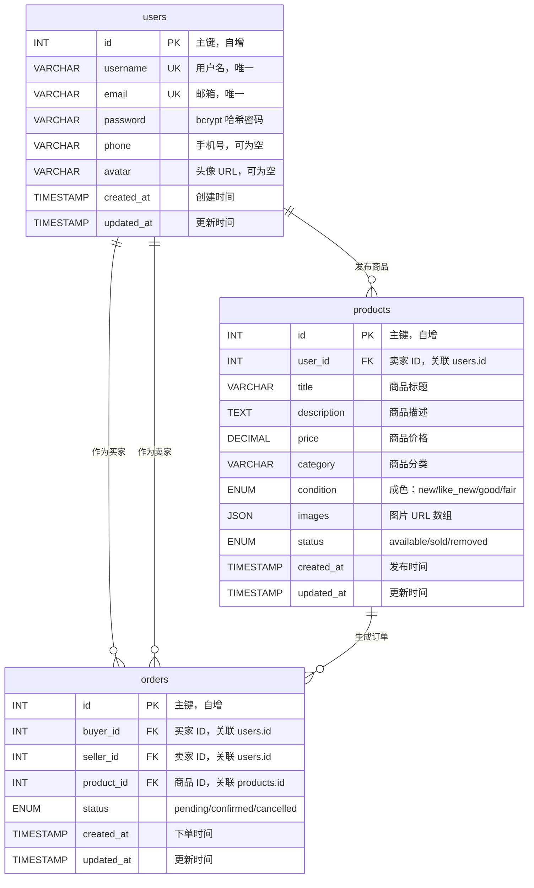

ER 图说明：

1. 一个用户可以发布多个商品，所以 `users.id` 与 `products.user_id` 是一对多关系。
2. 一个用户可以作为买家产生多个订单，所以 `users.id` 与 `orders.buyer_id` 是一对多关系。
3. 一个用户也可以作为卖家收到多个订单，所以 `users.id` 与 `orders.seller_id` 是一对多关系。
4. 一个商品可以关联订单记录。业务上通过商品状态和事务控制，正常购买流程中同一时刻只允许一个有效订单。

### 6.3 核心数据表概览

| 表名 | 作用 | 关键字段 | 主要业务 |
|---|---|---|
| `users` | 用户账户信息 | `id`、`username`、`email`、`password`、`phone`、`avatar` | 注册、登录、用户展示 |
| `products` | 商品信息 | `id`、`user_id`、`title`、`description`、`price`、`category`、`condition`、`images`、`status` | 发布、浏览、搜索、下架、成交 |
| `orders` | 订单信息 | `id`、`buyer_id`、`seller_id`、`product_id`、`status` | 下单、查看订单、确认、取消 |

### 6.4 用户表 `users`

`users` 表保存平台用户账号信息。

| 字段 | 类型 | 约束 | 说明 |
|---|---|---|---|
| `id` | `INT` | `PRIMARY KEY`、`AUTO_INCREMENT` | 用户主键 |
| `username` | `VARCHAR(50)` | `NOT NULL`、`UNIQUE` | 用户名，页面展示和用户名登录使用 |
| `email` | `VARCHAR(100)` | `NOT NULL`、`UNIQUE` | 邮箱，作为主要登录账号 |
| `password` | `VARCHAR(255)` | `NOT NULL` | bcrypt 哈希后的密码，不保存明文 |
| `phone` | `VARCHAR(20)` | `NULL` | 手机号，可选 |
| `avatar` | `VARCHAR(500)` | `NULL` | 头像 URL，可选 |
| `created_at` | `TIMESTAMP` | `DEFAULT CURRENT_TIMESTAMP` | 注册时间 |
| `updated_at` | `TIMESTAMP` | `DEFAULT CURRENT_TIMESTAMP ON UPDATE CURRENT_TIMESTAMP` | 更新时间 |

关键约束：

```sql
UNIQUE KEY uq_users_email (email),
UNIQUE KEY uq_users_username (username)
```

这样可以保证邮箱和用户名都不重复。后端注册接口在写入前也会调用 `checkEmailExists()` 和 `checkUsernameExists()` 做业务层校验，数据库唯一约束作为最后一道保护。

### 6.5 商品表 `products`

`products` 表保存卖家发布的商品信息。

| 字段 | 类型 | 约束 | 说明 |
|---|---|---|---|
| `id` | `INT` | `PRIMARY KEY`、`AUTO_INCREMENT` | 商品主键 |
| `user_id` | `INT` | `NOT NULL`、`FK -> users.id` | 卖家用户 ID |
| `title` | `VARCHAR(100)` | `NOT NULL` | 商品标题 |
| `description` | `TEXT` | `NULL` | 商品详细描述 |
| `price` | `DECIMAL(10,2)` | `NOT NULL` | 商品价格，保留两位小数 |
| `category` | `VARCHAR(50)` | `NOT NULL` | 商品分类 |
| `condition` | `ENUM` | `NOT NULL` | 成色，取值为 `new`、`like_new`、`good`、`fair` |
| `images` | `JSON` | `NULL` | 图片 URL 数组 |
| `status` | `ENUM` | `NOT NULL DEFAULT 'available'` | 商品状态 |
| `created_at` | `TIMESTAMP` | `DEFAULT CURRENT_TIMESTAMP` | 发布时间 |
| `updated_at` | `TIMESTAMP` | `DEFAULT CURRENT_TIMESTAMP ON UPDATE CURRENT_TIMESTAMP` | 更新时间 |

商品成色字段使用枚举：

```sql
`condition` ENUM('new', 'like_new', 'good', 'fair') NOT NULL
```

商品状态字段也使用枚举：

```sql
status ENUM('available', 'sold', 'removed') NOT NULL DEFAULT 'available'
```

状态含义：

| 状态 | 含义 | 触发场景 |
|---|---|---|
| `available` | 在售 | 商品刚发布，或订单取消后恢复 |
| `sold` | 已售出 | 买家创建订单成功后更新 |
| `removed` | 已下架 / 软删除 | 卖家删除商品时更新 |

商品图片选择 JSON 字段而不是单独建图片表，是因为课程项目中图片只需要随商品展示，不需要对单张图片做复杂查询。后端写入时使用：

```js
JSON.stringify(images || [])
```

查询时再解析：

```js
images: parseImages(row.images)
```

这种方案减少了表数量和 JOIN 复杂度，也能支持多图展示。图片数量上限由后端业务逻辑控制为 5 张。

外键约束：

```sql
CONSTRAINT fk_products_user
  FOREIGN KEY (user_id) REFERENCES users (id)
  ON DELETE CASCADE
```

含义是如果用户被删除，其发布的商品也会被级联删除。实际业务中项目更多使用软删除商品，避免历史交易数据丢失。

### 6.6 订单表 `orders`

`orders` 表记录买家和卖家围绕某个商品形成的交易。

| 字段 | 类型 | 约束 | 说明 |
|---|---|---|---|
| `id` | `INT` | `PRIMARY KEY`、`AUTO_INCREMENT` | 订单主键 |
| `buyer_id` | `INT` | `NOT NULL`、`FK -> users.id` | 买家 ID |
| `seller_id` | `INT` | `NOT NULL`、`FK -> users.id` | 卖家 ID |
| `product_id` | `INT` | `NOT NULL`、`FK -> products.id` | 商品 ID |
| `status` | `ENUM` | `NOT NULL DEFAULT 'pending'` | 订单状态 |
| `created_at` | `TIMESTAMP` | `DEFAULT CURRENT_TIMESTAMP` | 下单时间 |
| `updated_at` | `TIMESTAMP` | `DEFAULT CURRENT_TIMESTAMP ON UPDATE CURRENT_TIMESTAMP` | 更新时间 |

订单状态：

```sql
status ENUM('pending', 'confirmed', 'cancelled') NOT NULL DEFAULT 'pending'
```

状态含义：

| 状态 | 含义 | 触发场景 |
|---|---|---|
| `pending` | 待确认 / 交易中 | 买家创建订单后 |
| `confirmed` | 已确认 | 卖家确认订单 |
| `cancelled` | 已取消 | 买家或卖家取消订单 |

订单表中保留 `seller_id` 是一个有意的冗余设计。理论上卖家可以通过 `orders.product_id -> products.user_id` 推导出来，但订单列表经常需要按“我卖出的订单”查询。如果没有 `seller_id`，每次查询都要 JOIN products 表再过滤；保留 `seller_id` 可以直接按 `orders.seller_id` 建索引查询，提升读多场景下的效率。

外键删除策略：

```sql
CONSTRAINT fk_orders_buyer
  FOREIGN KEY (buyer_id) REFERENCES users (id)
  ON DELETE RESTRICT

CONSTRAINT fk_orders_seller
  FOREIGN KEY (seller_id) REFERENCES users (id)
  ON DELETE RESTRICT

CONSTRAINT fk_orders_product
  FOREIGN KEY (product_id) REFERENCES products (id)
  ON DELETE RESTRICT
```

订单使用 `RESTRICT` 而不是 `CASCADE`，原因是订单属于交易记录，不应该因为用户或商品删除而自动丢失。这样可以保留历史交易链路。

### 6.7 索引设计

| 表 | 索引 | 字段 | 用途 |
|---|---|---|---|
| `users` | `uq_users_email` | `email` | 登录时按邮箱查询，同时保证唯一 |
| `users` | `uq_users_username` | `username` | 用户名登录和唯一性校验 |
| `products` | `idx_products_user_id` | `user_id` | 查询某个用户发布的商品 |
| `products` | `idx_products_status` | `status` | 首页只查在售商品、过滤已售出或下架商品 |
| `products` | `idx_products_category` | `category` | 首页按分类筛选 |
| `orders` | `idx_orders_buyer_id` | `buyer_id` | 查询“我买到的订单” |
| `orders` | `idx_orders_seller_id` | `seller_id` | 查询“我卖出的订单” |
| `orders` | `idx_orders_product_id` | `product_id` | 查询某个商品关联的订单 |

商品列表还支持关键词搜索和价格排序。关键词搜索通过 SQL `LIKE` 对 `title` 和 `description` 做模糊匹配；排序字段在后端使用白名单控制，只允许 `created_at`、`price`、`title`，避免用户传入任意 SQL 字段。

### 6.8 业务状态流转

商品状态流转：

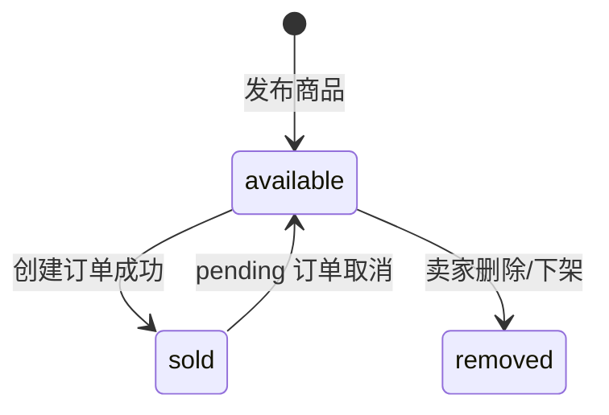

订单状态流转：

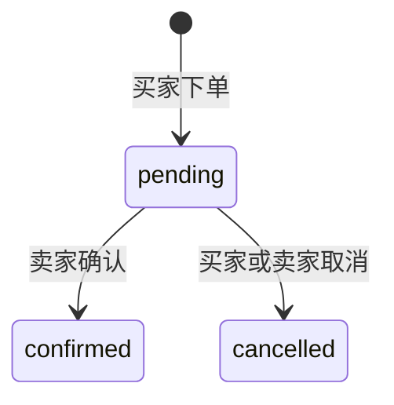

项目中订单创建和取消都使用事务维护状态一致性。创建订单时，后端先用 `FOR UPDATE` 锁定商品行：

```sql
SELECT id, user_id, status
FROM products
WHERE id = ?
FOR UPDATE
```

然后在同一个事务中插入订单并把商品状态改为 `sold`。取消订单时，在同一个事务中把订单状态改为 `cancelled`，再把商品状态恢复为 `available`。如果中间任一步失败，事务回滚，避免出现订单和商品状态不一致。

### 6.9 测试数据设计

`seed-data.sql` 用于初始化演示数据，包含：

| 数据类型 | 数量 | 说明 |
|---|---:|---|
| 用户 | 5 个 | 覆盖不同卖家和买家 |
| 商品 | 12 个 | 覆盖书籍、数码、交通工具、生活用品、服装等分类 |
| 订单 | 5 个 | 覆盖 `pending`、`confirmed`、`cancelled` 状态 |

所有测试用户密码均为：

```text
Password123!
```

脚本中保存的是 bcrypt 哈希，不是明文密码。测试商品包含多图 JSON、不同分类、不同成色和不同价格，方便前端验证首页筛选、商品详情、订单列表和状态展示。

### 6.10 数据库设计结果

最终数据库设计满足以下结果：

1. 能支持用户注册、邮箱/用户名唯一校验、登录和个人信息展示。
2. 能支持商品发布、商品列表、分类筛选、搜索、排序、我的商品和软删除。
3. 能支持订单创建、买家订单、卖家订单、订单详情、确认和取消。
4. 能通过外键保证用户、商品、订单之间的引用关系。
5. 能通过索引支撑常用查询，减少全表扫描。
6. 能通过事务和行锁保证购买流程中的状态一致性。
7. 能通过 seed 数据快速启动演示环境和测试环境。

---

## 七、AI 文案与定价功能

AI 功能集成在发布商品页面，目标是降低卖家发布商品时写描述和估价的成本。用户填写标题、分类、成色、价格、描述并上传图片后，可以点击“生成文案”或“生成定价”。前端会把当前表单上下文发送给后端：

```http
POST /api/products/generate
```

请求数据包括：

```json
{
  "title": "iPad Air",
  "price": 188,
  "category": "数码产品",
  "condition": "like_new",
  "description": "已有描述",
  "images": ["/uploads/demo.jpg"],
  "generationType": "description"
}
```

### 7.1 前端触发与参数组装

发布页通过两个按钮区分生成类型：

| 按钮 | `generationType` | 作用 |
|---|---|---|
| 生成文案 | `description` | 重点生成自然的商品描述，同时返回配套估价 |
| 生成定价 | `price` | 重点估算合理二手价格，同时返回一句简短说明 |

前端点击按钮后，会从当前 `form` 中读取标题、分类、成色、价格、描述和图片数组，再调用：

```js
products.generate({
  title: form.title,
  category: form.category,
  condition: form.condition,
  price: form.price,
  description: form.description,
  images: form.images,
  generationType: 'description'
})
```

`products.generate()` 在 `frontend/src/api/index.js` 中封装为：

```js
generate: (data) => request.post('/products/generate', data)
```

请求会经过 Axios 拦截器自动带上 JWT：

```http
Authorization: Bearer <token>
```

因为 AI 生成接口会消耗服务端资源，并且属于发布商品流程的一部分，所以后端路由要求登录。

### 7.2 后端路由、鉴权与参数校验

1. `routes/products.js` 将 `/generate` 路由挂载到 `productsController.generate`。
2. `authMiddleware` 校验用户是否登录。
3. `productsController.generate` 校验 `generationType` 和图片数量。
4. `aiProductService.generateProductSuggestion` 构造 prompt。
5. 后端读取 `ARK_API_KEY`、`ARK_MODEL`、`ARK_BASE_URL`。
6. 调用火山方舟兼容 Chat Completions 的接口：

```http
POST https://ark.cn-beijing.volces.com/api/v3/chat/completions
```

默认模型为：

```text
doubao-seed-2-0-mini-260215
```

控制器层先做轻量校验，避免无效请求进入 AI 服务：

```js
if (!['description', 'price'].includes(generationType)) {
  return res.status(400).json({ code: 400, message: '生成类型无效', data: null })
}

if (images && (!Array.isArray(images) || images.length > 5)) {
  return res.status(400).json({ code: 400, message: '图片数量不能超过 5 张', data: null })
}
```

校验通过后调用 `generateProductSuggestion()`，把商品上下文交给服务层处理。这样 Controller 只负责 HTTP 参数和响应，具体 prompt、图片读取、模型调用、JSON 解析都放在 service 中。

### 7.3 Prompt 构造策略

AI 服务通过 `buildPrompt(payload)` 构造中文提示词。提示词包含：

1. 角色设定：模型是“校园二手交易平台的商品发布助手”。
2. 商品上下文：标题、分类、成色、已有描述、当前价格、图片数量。
3. 生成目标：根据 `generationType` 决定重点生成文案还是重点估价。
4. 风格约束：文案要像学生真实发布闲置，不要营销腔，不要每次使用同一句模板。
5. 价格约束：价格必须是人民币数字，适合校园二手交易，可略低于常规二手平台。
6. 输出格式：只返回 JSON，不返回 Markdown。

核心要求如下：

```text
只返回 JSON，格式为 {"description":"...","price":123}，不要返回 Markdown。
```

服务层还会生成 `requestNonce`，让每次请求的 prompt 有轻微差异，减少模型每次输出完全相同模板的概率。

### 7.4 AI 图片处理

AI 图片处理并不是在 AI 接口中重新上传图片，而是复用平台已经上传成功的图片 URL。

具体流程：

1. 用户先通过 `ImageUploader` 上传图片。
2. 后端 Multer 将文件保存到 `uploads/`。
3. 上传接口返回 `/uploads/xxx.jpg`。
4. 发布页将该 URL 放入 `form.images`。
5. 调用 AI 生成时，后端读取 `images[0]`。
6. 后端校验路径必须在 `/uploads/` 下，拒绝 `..` 等危险路径。
7. 后端读取本地图片文件，限制最大 4MB。
8. 图片被转为 base64 data URL。
9. data URL 以 `image_url` 形式加入 Chat Completions 消息。

目前 AI 实际只读取第一张图片；如果图片不存在、路径不合法或超过限制，则退化为纯文本生成。

图片读取的安全处理在 `getUploadedImageDataUrl()` 中完成。它会先尝试从 URL 中提取 pathname，再查找 `/uploads/` 标记，只允许读取上传目录下的文件：

```js
const marker = '/uploads/'
const markerIndex = normalizedPath.indexOf(marker)
if (markerIndex === -1) return null

const relativeUploadPath = normalizedPath.slice(markerIndex + marker.length)
if (!relativeUploadPath || relativeUploadPath.includes('..')) return null
```

随后使用 `path.resolve()` 和 `path.relative()` 再次确认文件没有逃出 uploads 根目录。如果文件不存在、路径不合法或图片超过 4MB，函数返回 `null`，AI 请求会退化为纯文本生成，而不是直接报错中断。

### 7.5 模型调用与超时处理

服务层调用火山方舟兼容 Chat Completions 的接口：

```http
POST https://ark.cn-beijing.volces.com/api/v3/chat/completions
```

请求头使用：

```http
Authorization: Bearer <ARK_API_KEY>
Content-Type: application/json
```

请求体包含模型 ID、messages、temperature 和 max_tokens：

```js
body: JSON.stringify({
  model,
  messages: [
    {
      role: 'user',
      content: buildUserContent(payload)
    }
  ],
  temperature: 0.95,
  max_tokens: 600
})
```

为了避免 AI 请求长时间阻塞后端，服务层使用 `AbortController` 设置 20 秒超时：

```js
const controller = new AbortController()
const timeout = setTimeout(() => controller.abort(), 20000)
```

如果超时，会抛出“Doubao AI 调用超时”的服务错误；如果 provider 返回非 2xx，会把状态码和前 200 字符响应内容包装成错误，交给统一错误处理中间件返回。

### 7.6 返回 JSON 解析与结果标准化

模型返回的内容位于：

```js
data?.choices?.[0]?.message?.content
```

由于模型可能返回 Markdown 代码块，例如：

```text
```json
{"description":"测试文案","price":88}
```
```

服务层会先去掉 ```json 和 ```，再从文本中截取第一个 `{` 到最后一个 `}`，然后执行 `JSON.parse()`。解析失败时返回服务错误，避免把不可控文本直接交给前端。

标准化结果时会检查：

1. `description` 必须是非空字符串。
2. `price` 必须是有限数字且大于 0。
3. `description` 最多保留 500 字。
4. `price` 保留两位小数。
5. `source` 固定为 `doubao`。

最终返回：

```json
{
  "description": "这是一段真实 AI 文案",
  "price": 88,
  "source": "doubao"
}
```

### 7.7 AI 文案如何填回前端

后端返回格式为：

```json
{
  "code": 200,
  "message": "success",
  "data": {
    "description": "AI 生成的商品文案",
    "price": 188,
    "source": "doubao"
  }
}
```

前端在 `PublishView.vue` 中执行：

```js
form.description = suggestion.description
```

商品描述输入框使用：

```vue
<el-input v-model="form.description" type="textarea" />
```

因此 `form.description` 更新后，页面上的文本框会自动显示 AI 生成文案。AI 定价同理，返回的 `price` 会写入 `form.price`。

### 7.8 AI 功能的异常场景

AI 功能没有把异常隐藏在前端，而是通过后端错误返回暴露可理解的失败原因。主要异常包括：

| 异常 | 处理方式 |
|---|---|
| 未配置 `ARK_API_KEY` | 服务层抛出 503，提示无法调用 Doubao AI |
| Node 环境不支持 `fetch` | 抛出 503，提示当前 Node 版本不支持 fetch |
| `generationType` 非法 | Controller 返回 400 |
| 图片数量超过 5 张 | Controller 返回 400 |
| 图片路径非法或图片过大 | 忽略图片，退化为纯文本生成 |
| provider 返回错误 | 抛出 502，并带上 provider 状态码摘要 |
| 模型返回非 JSON | 抛出 502，提示未返回可解析 JSON |
| JSON 缺少有效 description 或 price | 抛出 502，提示返回格式无效 |

---

## 八、测试与质量保障

项目包含前端测试、后端单元测试、后端集成测试、MySQL 测试库和覆盖率统计。测试目标不是只验证“能启动”，而是固定核心业务行为：鉴权、SQL 组装、事务状态、AI 请求参数、前端组件渲染、按钮交互、API 封装和 store 状态更新。

### 8.1 后端测试配置

后端使用 Jest，脚本为：

```bash
npm test
```

实际执行：

```bash
jest --coverage
```

后端测试文件位于：

```text
backend/src/test/
```

Jest 配置写在 `backend/package.json`：

```json
{
  "testEnvironment": "node",
  "setupFilesAfterEnv": ["<rootDir>/src/test/setup.js"],
  "testMatch": ["**/src/test/**/*.test.js"],
  "coverageReporters": ["text", "lcov", "html"],
  "coverageDirectory": "coverage",
  "testTimeout": 30000
}
```

其中 `setup.js` 会为测试环境设置默认环境变量：

```js
process.env.JWT_SECRET = process.env.JWT_SECRET || 'test_jwt_secret_key'
process.env.DB_HOST = process.env.DB_HOST || 'localhost'
process.env.DB_NAME = process.env.DB_NAME || 'campus_trade'
```

这样本地和 CI 都可以使用同一套测试入口。CI 中会覆盖这些变量，把数据库指向 `campus_trade_test`。

### 8.2 后端测试类型与覆盖内容

测试类型包括：

| 类型 | 工具 | 测试内容 |
|---|---|---|
| 单元测试 | Jest | model、middleware、AI service |
| 集成测试 | Supertest | 注册、登录、商品、订单、AI 生成接口 |
| 数据库测试 | MySQL 测试库 | 使用 `campus_trade_test` 隔离测试数据 |

后端测试文件包括：

| 测试文件 | 具体验证内容 |
|---|---|
| `authMiddleware.test.js` | 无 Authorization、错误格式、无效 token 返回 401；有效 token 写入 `req.user` 并调用 `next()` |
| `userModel.test.js` | 邮箱查询、用户名查询、创建用户、更新密码、更新用户信息等数据库操作 |
| `productModel.test.js` | 商品分页、搜索 LIKE、分类过滤、卖家 JOIN、JSON 图片解析、软删除、用户商品列表 |
| `orderModel.test.js` | 订单列表和详情的 JOIN 结果整理、商品/买家/卖家文本归一化 |
| `aiProductService.test.js` | prompt 构造、默认模型 ID、Ark 请求体、JSON 提取、缺少 API key 抛错 |
| `api.test.js` | 使用 Supertest 验证认证、商品等 API 行为 |
| `productGenerate.test.js` | 验证 `/api/products/generate` 需要 token，并能返回 AI 文案和价格 |

### 8.3 后端 mock 策略

后端单元测试会 mock 数据库连接池、JWT、fetch 等外部依赖。例如 model 测试中先 mock `../../config/db`：

```js
jest.mock('../../config/db', () => {
  const mockQuery = jest.fn()
  return { query: mockQuery }
})
```

然后通过 `pool.query.mockResolvedValueOnce(...)` 模拟数据库返回值，再断言 model 是否拼出正确 SQL 和参数。这样可以验证 SQL 逻辑，同时不依赖真实数据库。

认证中间件测试 mock `jsonwebtoken`：

```js
jest.mock('jsonwebtoken')
```

测试会分别构造无请求头、`Basic` 请求头、无效 Bearer token 和有效 Bearer token，断言返回状态码或 `req.user` 是否正确。

AI 服务测试 mock `global.fetch`，避免测试时真实调用外部模型：

```js
global.fetch = jest.fn().mockResolvedValue({
  ok: true,
  text: async () => JSON.stringify({
    choices: [{ message: { content: '{"description":"这是一段真实 AI 文案","price":88}' } }]
  })
})
```

测试会断言：

1. 请求 URL 是否为 `https://ark.cn-beijing.volces.com/api/v3/chat/completions`。
2. 请求头是否包含 `Authorization: Bearer test-ark-key`。
3. 请求体中的 `model` 是否为 `doubao-seed-2-0-mini-260215`。
4. prompt 是否包含商品标题和生成类型。
5. 返回值是否被标准化为 `{ description, price, source: 'doubao' }`。

集成测试使用 Supertest 直接请求 Express app，例如 `productGenerate.test.js` 会生成 JWT，再请求：

```http
POST /api/products/generate
Authorization: Bearer <token>
```

该测试 mock AI service，让测试重点放在路由、鉴权、参数传递和响应格式，而不是外部 provider。

### 8.4 MySQL 测试库

CI 中会启动 MySQL 8.0 服务，并创建：

```text
campus_trade_test
```

CI 会将 `init-db.sql` 中的：

```sql
USE campus_trade;
```

替换成：

```sql
USE campus_trade_test;
```

然后导入测试库。测试时通过环境变量指定：

```text
DB_NAME=campus_trade_test
DB_PASSWORD=test_password
JWT_SECRET=test_jwt_secret_key
```

这样集成测试可以真实读写数据库，但不会污染开发库或生产库。

### 8.5 前端测试配置

前端使用 Vitest，脚本为：

```bash
npm test
```

实际执行：

```bash
vitest run --coverage
```

前端测试位于：

```text
frontend/tests/
```

Vitest 配置位于 `frontend/vitest.config.js`：

```js
export default defineConfig({
  plugins: [vue()],
  test: {
    environment: 'happy-dom',
    globals: true,
    coverage: {
      provider: 'v8',
      reporter: ['text', 'lcov', 'html'],
      exclude: [
        'node_modules/',
        'tests/',
        '**/*.spec.js',
        '**/*.test.js'
      ]
    },
    pool: 'vmThreads'
  }
})
```

`happy-dom` 用来模拟浏览器 DOM 环境，`@vue/test-utils` 用来挂载 Vue 组件，`@vitest/coverage-v8` 用来生成覆盖率。覆盖率产物包括：

```text
frontend/coverage/index.html
frontend/coverage/lcov.info
```

其中 `lcov.info` 可上传 Codecov。

### 8.6 前端测试文件与验证点

测试内容包括：

| 测试文件 | 说明 |
|---|---|
| `ProductCard.test.js` | 商品卡片渲染、状态标签、编辑/删除事件 |
| `AppHeader.test.js` | 导航栏、搜索框、登录态显示 |
| `PublishView.generate.test.js` | AI 文案/定价按钮是否传递正确参数 |
| `productApi.test.js` | API 封装是否调用 `/products/generate` |
| `userStore.test.js` | Pinia 用户状态和 localStorage |
| `api.mock.test.js` | Axios mock 请求和失败场景 |

前端测试不真实请求后端，而是 mock `request.js`、`products.generate`、`vue-router`、`element-plus` 等依赖，重点验证页面交互和参数组装。

具体策略如下：

1. `ProductCard.test.js` 使用简化商品卡片组件，传入 mock 商品数据，断言标题、价格、状态、分类、卖家名称是否渲染；当 `showActions` 为 true 时断言编辑/删除按钮存在，并通过点击按钮断言 `edit`、`delete` 事件被触发。
2. `AppHeader.test.js` 使用 createRouter 和 createPinia 挂载组件，断言平台名称、搜索框、未登录登录按钮、登录后发布按钮、用户头像等状态。
3. `userStore.test.js` 创建新的 Pinia 实例并清空 localStorage，断言切换账号时 `setToken()` 会更新 token 和 userInfo，避免旧用户信息残留。
4. `productApi.test.js` mock `request.js`，断言 `products.generate(payload)` 实际调用 `request.post('/products/generate', payload)`。
5. `PublishView.generate.test.js` mock `products.generate`、`vue-router`、`element-plus` 和图标组件，挂载发布页后点击“生成文案”和“生成定价”，断言传给后端的 `generationType` 分别是 `description` 和 `price`。

### 8.7 前端 AI 测试细节

发布页 AI 测试使用 `flushPromises()` 等待异步调用完成。测试先给表单设置标题：

```js
wrapper.vm.form.title = 'iPad Air'
```

然后找到按钮并触发点击：

```js
await wrapper.findAll('button')
  .find((button) => button.text() === '生成文案')
  .trigger('click')
```

最后断言：

```js
expect(products.generate).toHaveBeenCalledWith(expect.objectContaining({
  title: 'iPad Air',
  generationType: 'description'
}))
```

定价按钮同理，只是断言 `generationType: 'price'`。这类测试的价值是固定前端和后端约定：按钮文案可以改，样式可以改，但传给接口的生成类型不能错。

### 8.8 覆盖率与 CI 结果

前后端测试都开启 coverage：

```bash
cd backend
npm test

cd frontend
npm test
```

后端输出：

```text
backend/coverage/lcov.info
backend/coverage/index.html
```

前端输出：

```text
frontend/coverage/lcov.info
frontend/coverage/index.html
```

GitHub Actions 中分别上传到 Codecov，并通过 flag 区分：

```text
backend
frontend
```

测试实现结果是：核心业务逻辑不再只靠手动演示验证。后端可以自动验证鉴权、SQL、AI service、接口响应；前端可以自动验证组件渲染、按钮事件、API 调用和 store 状态；CI 可以在合并前发现测试失败、lint 错误和覆盖率变化。

---

## 九、部署方式

项目主要使用 Docker Compose 部署。

### 9.1 开发环境部署

开发环境使用：

```bash
docker compose up -d
```

对应配置文件：

```text
compose.yaml
```

启动服务包括：

| 服务 | 技术 | 端口 |
|---|---|---|
| mysql | MySQL 8.0 | 宿主机 `3307` -> 容器 `3306` |
| backend | Node.js + Express | `3001` |
| frontend | Vite dev server | `80`、`5173` |

开发环境通过 volume 挂载源码，适合本地调试。

### 9.2 生产环境部署

生产环境使用：

```bash
docker compose -f compose.prod.yaml up -d
```

生产环境服务包括：

| 服务 | 实现 |
|---|---|
| mysql | MySQL 8.0，Docker volume 持久化 |
| backend | Node.js 生产镜像，运行 `node src/app.js` |
| frontend | Vite build 后由 nginx 托管静态文件 |

前端生产镜像流程：

1. 安装依赖。
2. 执行 `npm run build`。
3. 将 `dist/` 复制到 nginx 静态目录。
4. nginx 监听容器内 `8080`，宿主机映射到 `80`。

后端生产镜像支持 Docker secrets：

```text
DB_PASSWORD_FILE
JWT_SECRET_FILE
```

`backend/docker-entrypoint.sh` 会读取 secret 文件内容并写入环境变量。

### 9.3 镜像推送

GitHub Actions 中 `docker.yml` 会构建两个业务镜像：

```text
backend
frontend
```

并推送到 GitHub Container Registry：

```text
ghcr.io/<owner>/<repo>/backend:latest
ghcr.io/<owner>/<repo>/frontend:latest
```

完整部署运行时实际有三个镜像：

```text
mysql:8.0
backend
frontend
```

---

## 十、项目运行截图

### 10.1 首页商品列表

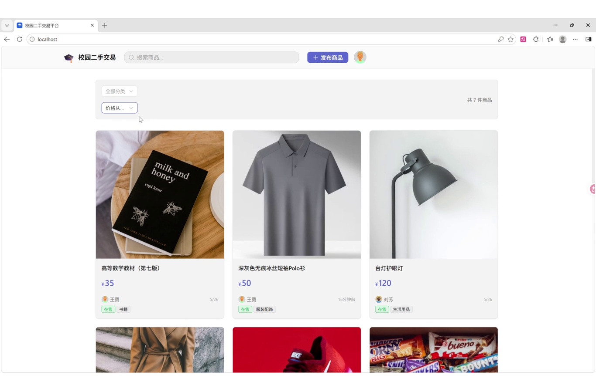

首页展示商品列表、分类筛选、价格排序、商品卡片、商品数量和状态标签。商品卡片中包含图片、名称、价格、卖家和分类，适合用户快速浏览。

### 10.2 我的收藏页面

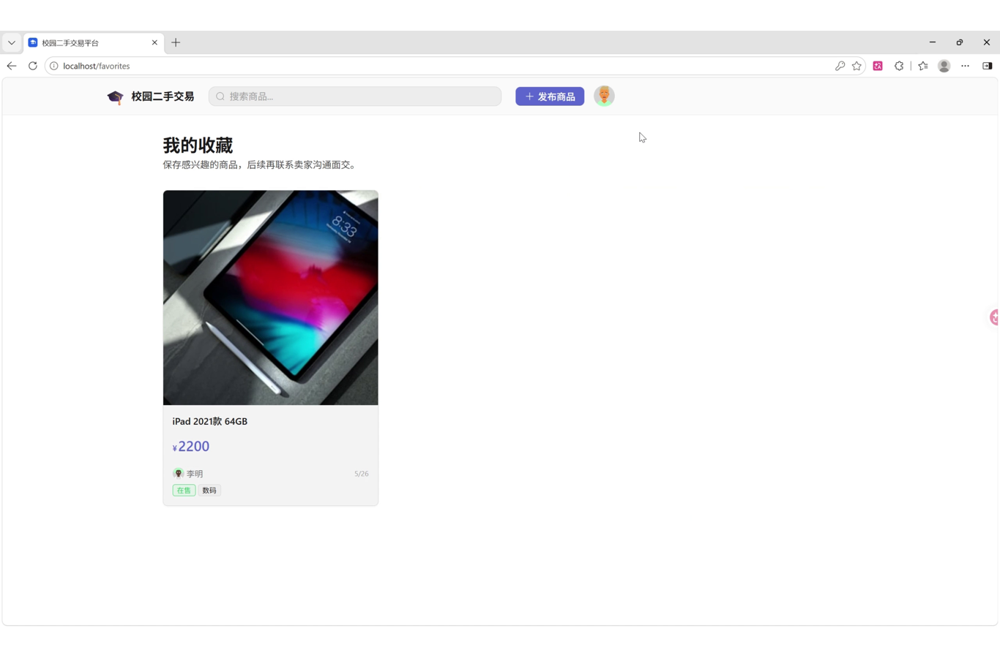

收藏页展示用户保存的感兴趣商品。页面保留顶部导航、搜索框和发布入口，主体区域显示收藏商品卡片，方便买家后续联系卖家或继续查看商品。

### 10.3 演示字幕：发布与 AI 辅助流程说明

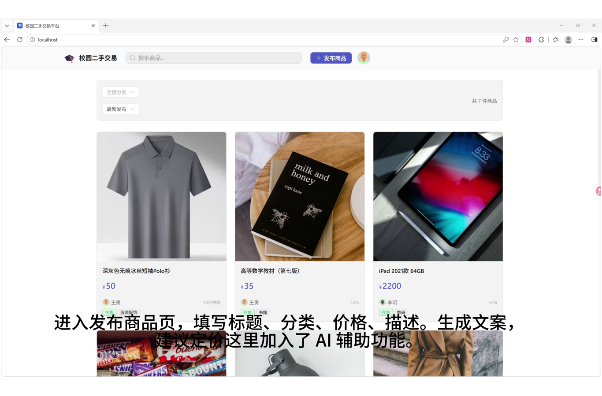


### 10.4 发布商品表单与 AI 辅助按钮

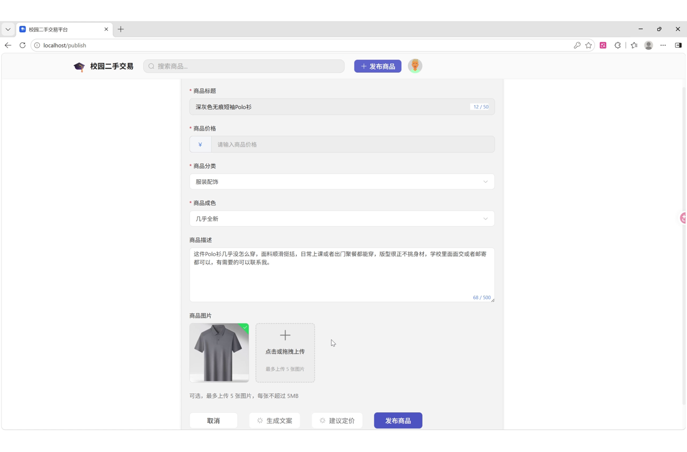

发布商品页包含商品标题、价格、分类、成色、描述和图片上传字段，底部提供“生成文案”“建议定价”“发布商品”等操作按钮。

### 10.5 消息沟通与交易流程

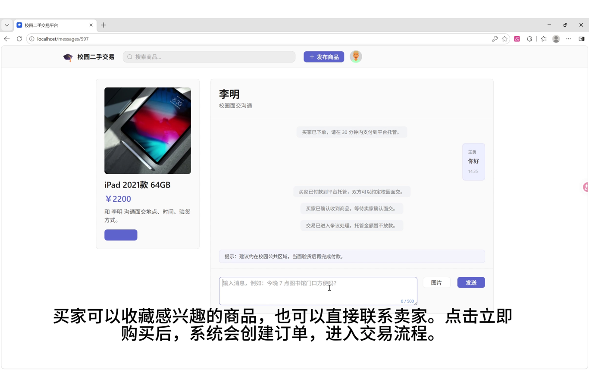

消息页面左侧展示关联商品信息，右侧是买卖双方沟通窗口，并包含交易流程提示、消息输入框、图片按钮和发送按钮。该页面体现了从收藏、联系卖家到创建订单后的沟通闭环。

---

## 十一、系统监控与日志

系统监控是项目后期补充的重要工程化内容，目的是让后端服务不只是“能跑起来”，还能够被检查、被观察、被定位问题。项目提供健康检查、结构化请求日志和基础运行指标三个入口。

### 11.1 健康检查接口

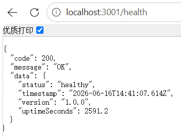

后端提供 `/health` 和 `/api/health` 健康检查接口。浏览器访问 `http://localhost:3001/health` 时，接口返回统一 JSON：

```json
{
  "code": 200,
  "message": "OK",
  "data": {
    "status": "healthy",
    "timestamp": "2026-06-16T14:41:07.614Z",
    "version": "1.0.0",
    "uptimeSeconds": 2591.2
  }
}
```

实现方式是在 Express 应用中注册健康检查路由，返回服务状态、当前时间、版本号和运行时长。Docker Compose 和人工验收都可以通过该接口判断后端是否正常运行。实现结果是：服务启动后可以直接通过浏览器或 curl 检查 API 存活状态，避免只依赖前端页面判断后端是否可用。

### 11.2 结构化请求日志

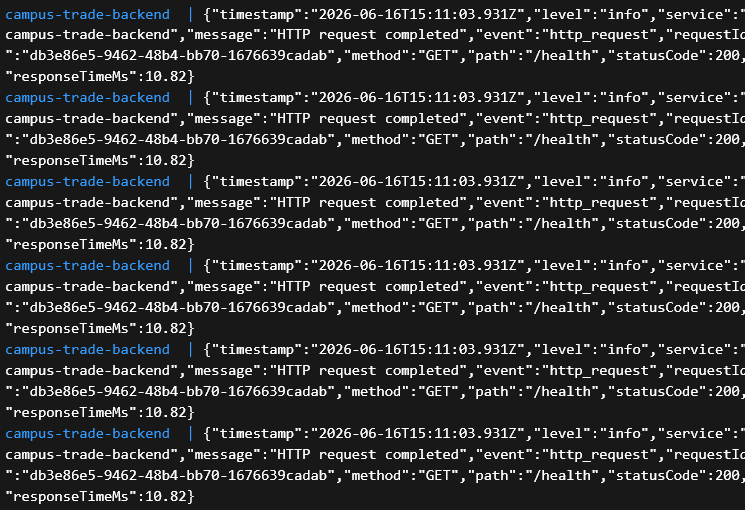

后端日志采用结构化 JSON 输出。每条请求日志包含 `timestamp`、`level`、`service`、`message`、`event`、`requestId`、`method`、`path`、`statusCode` 和 `responseTimeMs` 等字段。截图中可以看到 `/health` 请求完成后，日志记录了请求路径、状态码 200 和响应耗时。

实现方式是在请求处理中间件里为每个请求生成 `requestId`，并在响应结束时输出一条结构化日志。相比普通字符串日志，JSON 日志更适合后续接入日志平台，也方便通过关键字段检索，例如按 `requestId` 追踪一次请求，按 `statusCode` 查找错误响应，按 `responseTimeMs` 排查慢接口。

实现结果是：后端运行时不再只能看到零散输出，而是能形成可检索、可审计的请求记录。演示中连续访问健康检查接口后，容器日志可以稳定输出多条结构化请求日志。

### 11.3 指标接口

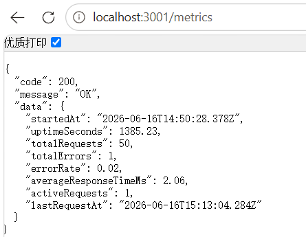

后端提供 `/metrics` 指标接口，浏览器访问 `http://localhost:3001/metrics` 时返回基础运行指标：

```json
{
  "code": 200,
  "message": "OK",
  "data": {
    "startedAt": "2026-06-16T14:50:28.378Z",
    "uptimeSeconds": 1385.23,
    "totalRequests": 50,
    "totalErrors": 1,
    "errorRate": 0.02,
    "averageResponseTimeMs": 2.06,
    "activeRequests": 1,
    "lastRequestAt": "2026-06-16T15:13:04.284Z"
  }
}
```

实现方式是在后端内存中维护请求计数、错误计数、活动请求数、总响应耗时和最近请求时间。每次请求进入时增加 `activeRequests` 和 `totalRequests`，响应结束后记录耗时并减少活动请求数；如果状态码为错误响应，则增加错误计数。`/metrics` 读取这些统计值并计算错误率和平均响应时间。

实现结果是：项目可以直接展示后端运行时间、请求总数、错误数量、错误率、平均响应时间和当前活动请求数。这些指标虽然不是完整 Prometheus 方案，但已经满足课程项目中“基础监控与运行状态展示”的要求，也为后续接入专业监控系统留下了清晰入口。

---

## 十二、具体工作内容与实现结果

### 12.1 已完成的核心功能

| 功能 | 实现结果 |
|---|---|
| 用户注册登录 | 支持账号注册、登录、JWT 登录态保存 |
| 商品浏览 | 支持商品列表、分类、搜索、排序和分页 |
| 商品详情 | 支持商品图片、价格、描述、卖家信息展示 |
| 商品发布 | 支持标题、价格、分类、成色、描述、图片上传 |
| 商品管理 | 支持我的商品、编辑、删除 |
| 订单管理 | 支持创建订单、查看订单、确认和取消 |
| 图片上传 | 支持本地上传、预览、大小和路径校验 |
| AI 文案 | 支持调用豆包模型生成商品描述 |
| AI 定价 | 支持调用豆包模型给出价格建议 |
| 测试覆盖 | 前后端均配置单元测试和覆盖率 |
| 容器化部署 | 提供开发和生产 Docker Compose 配置 |
| 演示材料 | 已提供演示视频和项目报告 |

### 12.2 分阶段实现方式与结果

| 阶段 | 如何实现 | 实现结果 |
|---|---|---|
| UI 设计 | 先根据校园二手交易场景划分首页、详情、发布、个人中心、我的商品、订单等核心页面，再设计商品卡片、按钮、输入框、标签、头像、卡片容器、空状态、加载状态和错误状态；通过 Figma 输出高保真原型，并整理颜色、字体、间距、圆角、阴影、深色模式和无障碍规范。 | 形成了统一的视觉风格和交互规范，前端开发可以按设计稿落地页面；商品列表、发布表单、个人中心和订单页面的布局逻辑清晰，减少了后续页面风格不一致的问题。 |
| 架构设计 | 前端采用 views、components、stores、api、utils 分层；后端采用 routes、controllers、services、models、middlewares 分层；数据库通过 ER 图和 SQL 明确 users、products、orders 等核心表；项目规范写入 `CLAUDE.md`，约束目录结构、接口格式、鉴权方式和禁止事项。 | 项目具备清晰的前后端边界。页面只负责展示和交互，API 层负责请求，Store 负责状态；后端路由只做入口分发，Controller 处理业务请求，Model 负责 SQL。后续新增功能可以按模块扩展。 |
| API 设计 | 后端按 RESTful 风格设计认证、商品、订单、上传、AI 生成接口，统一返回 `{ code, message, data }`；补充 OpenAPI 规范、API 文档和 Postman 集合；前端通过 `frontend/src/api/index.js` 按 auth、products、orders、upload 模块封装调用。 | 前后端通过稳定接口协作，前端不直接拼接散乱 URL，后端返回格式一致；文档和 Postman 集合让接口可以被调试、复现和验收。 |
| 前端实现 | 使用 Vue 3 + Vite + Element Plus 开发页面，使用 Vue Router 管理路由，使用 Pinia 保存登录态和用户信息，使用 Axios 拦截器自动携带 JWT；封装 `AppHeader`、`ProductCard`、`ImageUploader` 等组件；发布页接入 AI 文案和建议定价按钮。 | 实现了首页浏览、搜索筛选、商品详情、登录注册、发布商品、图片上传、收藏、消息沟通、个人中心、我的商品、订单展示和 AI 回填等用户可见功能。 |
| 后端实现 | 使用 Node.js + Express 搭建 API 服务，使用 `mysql2/promise` 连接 MySQL；认证模块使用 bcryptjs 哈希密码和 JWT 鉴权；商品、订单和上传模块分别封装 Controller 与 Model；订单创建和取消使用事务维护商品状态；AI 服务通过后端统一调用模型接口。 | 后端可以支撑完整交易链路：用户注册登录、商品发布和查询、订单创建和状态流转、图片上传、AI 生成。事务和参数化 SQL 提升了数据一致性和安全性。 |
| 测试 | 后端使用 Jest + Supertest，覆盖 model、middleware、AI service 和 API 集成场景；前端使用 Vitest + Vue Test Utils + happy-dom，覆盖组件渲染、交互事件、API mock、发布页 AI 按钮和 store；覆盖率报告输出 text、lcov、html。 | 测试从手动点击扩展到自动化验证。后端能验证 SQL 参数、鉴权、错误处理和接口行为；前端能验证组件显示、事件触发、请求参数和 AI 回填逻辑。 |
| CI/CD | 使用 GitHub Actions 配置前端 job、后端 job 和 Docker job；前后端分别执行依赖安装、lint、测试和覆盖率上传；后端 CI 启动 MySQL 8.0 服务容器并初始化 `campus_trade_test`；Codecov 用 flag 区分前后端覆盖率。 | 每次提交后可以自动检查代码风格、运行测试、生成覆盖率并上传；测试数据库隔离了 CI 数据，减少“本地能跑、CI 不能跑”的问题。 |
| 安全审查 | 前端增加 CSRF token 请求头、URL 清理和 XSS 防护工具；后端隐藏生产环境错误细节、增加登录失败限频、校验上传文件路径、使用参数化 SQL、通过环境变量读取密钥；安全工作流使用 Gitleaks 和依赖扫描。 | 项目减少了常见安全风险：避免明文密码、减少敏感错误泄露、防止暴力登录、降低危险 URL 注入和路径遍历风险，并通过自动扫描降低密钥误提交风险。 |
| Docker 部署 | 前端和后端使用多阶段 Dockerfile；开发环境使用 Compose 启动 MySQL、backend、frontend，并支持前端热重载；生产环境使用 Nginx 托管前端静态资源、Node 运行后端、MySQL volume 持久化；生产密钥通过 Docker secrets 读取；镜像推送到 GHCR，构建前执行 Trivy 扫描。 | 项目可以用 Docker Compose 一键启动，开发和生产配置分离；镜像构建、扫描和推送流程固定下来，降低部署步骤遗漏。运行时包含 frontend、backend、mysql 三个服务。 |
| 系统监控 | 后端增加 `/health`、`/api/health` 和 `/metrics`，并输出结构化请求日志；内存中统计启动时间、运行时长、请求总数、错误数、错误率、平均响应时间、活动请求数和最后请求时间。 | 项目具备基础可观测性：可以通过浏览器或 curl 检查服务健康，通过日志追踪请求，通过指标接口查看运行状态和错误率，便于演示、验收和故障定位。 |

### 12.3 工程化结果

项目完成的不只是业务功能，还包括以下工程化建设：

1. 前后端分离目录结构清晰。
2. 后端接口返回结构统一。
3. 数据库表结构、初始化脚本和测试数据完整。
4. Docker Compose 可以编排 MySQL、后端、前端。
5. 生产环境区分 dev/prod Dockerfile target。
6. CI 可以运行 lint、测试和覆盖率上传。
7. Codecov 徽章用于展示覆盖率。
8. 安全扫描、密钥示例、Docker secrets 支持逐步完善。
9. 演示视频已放入本报告文件夹，文件名为 `campus-trade-demo.mp4`。
10. 项目文档覆盖架构、接口、数据库、测试、部署和贡献说明。

---

## 十三、贡献说明

本节根据 `docs/contributions/` 目录下的 17 个贡献文件整理，覆盖 UI 设计、架构设计、API、前后端实现、测试、CI/CD、安全审查和 Docker 部署等阶段。

### 13.1 贡献文件覆盖范围

| 阶段 | 来源范围 | 记录内容 |
|---|---|---|
| UI 设计 | `02-ui/` | 页面原型、交互流程、设计规范、组件规范、Figma 设计 |
| 架构设计 | `03-architecture/` | 前端分层、后端分层、数据库设计、项目规范、开发环境 |
| API 设计 | `04-api/` | 前端 API 封装、后端 RESTful API、OpenAPI、Postman 集合 |
| 前端实现 | `05-frontend/` | Vue 页面、组件、样式系统、路由、状态管理、接口对接 |
| 后端实现 | `06-backend/` | Express 接口、MySQL 模型、事务、初始化脚本、Docker 后端基础 |
| 测试 | `08-testing/` | Vitest、Vue Test Utils、Jest、Supertest、覆盖率报告 |
| CI/CD | `09-cicd/` | GitHub Actions、ESLint、Codecov、MySQL 测试服务容器 |
| 安全审查 | `10-security/` | 前端 CSRF/XSS 防护、后端错误隐藏、登录限频、上传路径校验 |
| Docker 部署 | `11-docker/` | 多阶段 Dockerfile、Compose、健康检查、GHCR、Trivy 扫描 |

### 13.2 王勇：后端、数据库、安全、CI 与部署

主要承担后端和数据库工作，同时参与项目规范、CI/CD、安全审查和 Docker 部署。

#### 13.2.1 UI 与设计规范工作

在 UI 设计阶段，负责登录页、注册页、发布商品页和 404 错误页设计；制定颜色系统、字体排版、按钮、输入框、卡片、对话框、动画、阴影、圆角、间距等设计规范；整理浅色和深色主题的设计 token，并编写设计说明、组件使用指南、深色模式实现指南和无障碍设计指南。登录页强调清晰的账号密码输入、记住我、忘记密码和注册入口；注册页规划多步表单、进度条、验证码、密码强度提示和协议确认；发布页规划图片上传、基础信息、详细描述、参数自定义和预览面板。

#### 13.2.2 架构设计与项目规范

编写 `CLAUDE.md`，明确项目技术栈、目录结构、代码规范、API 规范和禁止事项，包括禁止明文密码、禁止提交 `.env`、禁止硬编码 API 地址等规则。还编写 `docs/architecture.md`，通过系统整体架构图、前端层次图、后端模块图、中间件链路图以及登录、发布商品、创建订单等时序图说明系统结构。

数据库设计方面，编写 `docs/database.md`，设计 users、products、orders 三张核心表，补充 ER 图、字段说明、建表 SQL、索引设计和业务约束。后端架构方面，初始化 `backend/` 目录，建立 `app.js`、数据库连接、认证中间件、错误处理中间件、routes、controllers、services、models 等基础结构，为后续接口开发提供框架。

#### 13.2.3 后端 API 与数据库实现

负责后端 RESTful API 的设计和实现，统一响应格式为 `{ code, message, data }`。认证模块包括注册、登录、获取当前用户和修改密码，密码使用 bcryptjs 哈希，登录成功后签发 JWT。商品模块包括商品列表、详情、创建、更新、删除和我的商品，支持分页、搜索、分类、价格范围、状态过滤和排序。订单模块包括创建订单、订单列表、订单详情、确认订单和取消订单，区分买家和卖家的访问权限。上传模块使用 Multer 接收图片，验证文件类型和大小，并返回可访问的图片路径。

数据库模型方面，实现 `userModel.js`、`productModel.js` 和 `orderModel.js`，使用 `mysql2/promise` 连接池执行 SQL。所有查询使用参数化语句防止 SQL 注入；商品图片使用 MySQL JSON 字段保存 URL 数组；订单创建和取消使用事务，创建订单时锁定商品行并更新商品状态，取消订单时恢复商品状态，避免订单和商品状态不一致。

#### 13.2.4 文档、测试与质量保障

编写后端 API 文档、OpenAPI 规范和 Postman 测试集合，覆盖认证、商品、订单和上传等接口。测试方面，负责后端 Jest 与 Supertest 测试，覆盖认证中间件、用户模型、商品模型、订单模型、错误处理和 API 集成场景。后端测试使用独立 MySQL 测试库 `campus_trade_test`，避免污染开发库。

CI/CD 方面，创建 GitHub Actions 后端 job，配置 Node.js 18、`npm ci`、ESLint、Jest 覆盖率、Codecov 上传和 MySQL 8.0 服务容器。CI 中使用 `127.0.0.1` 连接 MySQL，配置 `campus_trade_test`、`test_password` 和 `test_jwt_secret_key`，并通过健康检查等待数据库可用。还配置后端 ESLint、`.eslintignore`、lint 脚本和 Jest 超时时间，修复缩进、尾随空格、未使用变量和分号风格问题。

#### 13.2.5 安全审查与修复

负责后端安全审查，检查 `app.js`、认证中间件、错误处理中间件、认证/商品/订单/上传控制器、路由、模型和数据库配置。安全审查发现并修复了生产环境错误信息泄露、缺少登录失败限制和文件上传路径校验不足等问题。修复包括：生产环境返回通用错误信息并保留后端日志；新增 `loginLimitMiddleware.js`，同一 IP 5 分钟内失败超过 5 次则临时锁定；上传文件使用 `path.resolve()` 校验必须位于允许目录内，并返回相对 URL，避免硬编码 localhost。

后端安全清单还包括密码哈希、JWT 过期时间、敏感接口鉴权、用户只能操作自己的商品和订单、参数化 SQL、环境变量读取密钥、`.env` 不提交仓库以及依赖安全扫描。安全 CI 使用 Gitleaks、npm audit、ESLint 和环境配置检查来降低泄密和依赖风险。

#### 13.2.6 Docker 与部署

负责后端 Dockerfile、开发和生产 Compose 配置、MySQL 健康检查、前后端健康检查、数据库持久化和 Docker secrets。后端 Dockerfile 改为多阶段结构，生产阶段只安装运行依赖并切换到非 root 用户。生产环境通过 `compose.prod.yaml` 使用 secret 文件管理数据库密码和 JWT 密钥，避免把真实密码写入 Compose 文件。还新增 `/health` 健康检查端点，同时保留 `/api/health`。

自动化部署方面，参与 `.github/workflows/docker.yml`，构建并推送 backend 和 frontend 镜像到 GHCR，镜像地址为 `ghcr.io/${{ github.repository }}/backend` 和 `ghcr.io/${{ github.repository }}/frontend`，构建前运行 Trivy 漏洞扫描，并使用 GitHub Actions cache 加速镜像构建。

### 13.3 马俊琛：前端、交互、API 对接、测试与前端部署

主要承担前端设计、前端架构、页面实现、组件封装、API 对接、前端测试、前端安全和前端 Docker 部署。

#### 13.3.1 UI 设计与交互设计

在 UI 阶段，负责首页/产品列表页、产品详情页、个人中心页、我的商品页、订单列表页、订单详情页和发布商品页初稿设计。交互方面，设计页面导航流程、商品搜索、图片轮播、状态反馈、下拉刷新规范、响应式布局和无障碍交互。组件方面，整理并应用 Badge、Button、Input、Avatar、Card 等组件规范，编写组件使用文档和响应式设计规范。设计阶段还产出了 6 个核心页面的 Figma 原型、色彩系统、字体排版、组件规范和交互注释。

页面设计细节包括：首页采用卡片式商品网格，支持 1/2/3 列响应式布局；产品详情页采用左图右信息的两栏结构；个人中心使用用户信息头部卡片和分组菜单；我的商品页复用商品卡片并增加编辑、下架、删除操作；订单列表和订单详情使用状态过滤、卡片列表和时间线展示交易进度。

#### 13.3.2 前端架构与开发环境

设计前端分层结构：`src/views/` 负责页面，`src/components/` 负责复用组件，`src/stores/` 负责 Pinia 状态，`src/api/` 负责接口函数，`src/utils/request.js` 负责 Axios 实例和拦截器。前端初始化内容包括 `package.json`、`vite.config.js`、`index.html`、`.env.example`、`src/main.js`、`src/App.vue`、路由、store、API 和请求工具。

路由设计中，为首页、登录、注册、商品详情、发布商品、编辑商品、订单列表、订单详情、个人中心和我的商品配置路由，并通过 `meta.requiresAuth` 和全局 `beforeEach` 守卫限制未登录用户访问受保护页面。网络请求方面，通过 Axios 请求拦截器自动附加 JWT，通过响应拦截器统一处理 `401` 并跳转登录页。状态管理方面，用户 token 和用户信息通过 Pinia 与 localStorage 保持同步。

#### 13.3.3 前端 API 封装与页面实现

实现前端 API 访问层 `frontend/src/api/index.js`，按 auth、products、orders、upload 模块封装函数。认证接口包括注册、登录、获取当前用户和修改密码；商品接口包括列表、详情、创建、更新、删除和我的商品；订单接口包括创建、列表、详情、确认和取消；上传接口负责商品图片上传并处理 multipart/form-data。

页面实现方面，开发 Linear 风格深色主题系统，新增 `linear-theme.css`、`element-override.scss` 和 `global.css`，用 CSS 变量管理颜色、字体、圆角、间距和阴影。核心组件包括 `AppHeader.vue`、`ProductCard.vue` 和 `ImageUploader.vue`。页面包括 `LoginView.vue`、`HomeView.vue`、`ProductDetailView.vue`、`ProfileView.vue` 和 `PublishView.vue`，实现登录注册、商品列表、筛选排序、商品详情、图片轮播、购买入口、个人中心、我的商品、订单展示、发布商品、图片上传和表单校验。

AI 前端对接方面，在发布页接入“生成文案”和“建议定价”按钮。用户点击按钮后，前端收集标题、分类、成色、价格、描述和图片 URL，调用 `products.generate()` 请求后端 `/api/products/generate`；后端返回后，将 `description` 写入 `form.description`，将 `price` 写入 `form.price`，因为表单使用 `v-model`，所以 AI 结果会自动回填到输入框。

#### 13.3.4 前端测试、CI 与覆盖率

负责前端测试文档和前端 Vitest 测试。测试技术栈包括 Vitest、Vue Test Utils、happy-dom 和 V8 coverage。测试覆盖 `ProductCard`、`AppHeader`、API mock、发布页 AI 生成、商品 API 封装和用户 store。组件测试关注渲染、状态标签、登录态显示、搜索框、编辑/删除事件；API mock 测试关注登录、注册、商品、订单和网络异常；发布页测试验证点击 AI 按钮后传递正确参数并回填结果。

CI/CD 方面，参与 `.github/workflows/ci.yml` 前端 job，配置 Node.js 18、npm 缓存、`npm ci`、`npm run lint`、`npm run test -- --run` 和 Codecov 上传。前端 ESLint 配置使用 Vue 3 推荐规则，统一 2 空格缩进、单引号、无分号、无尾随逗号，并排除 `node_modules/`、`dist/` 和 `coverage/`。Codecov 使用 frontend flag 上传 `frontend/coverage/lcov.info`，README 中添加 CI 和前端覆盖率徽章。

#### 13.3.5 前端安全与 Docker 部署

负责前端安全审查，检查入口、根组件、路由、请求封装、API、用户 store、登录注册页、首页、详情页、发布页、个人中心、导航栏、商品卡片和图片上传组件。修复包括：在 `request.js` 中为 POST/PUT/DELETE 请求生成并附加 `X-CSRF-Token`；创建 `xssProtection.js`，提供 HTML 转义、用户输入清理、安全 URL 判断和 URL 清理；在 `ImageUploader.vue` 和 `ProductDetailView.vue` 中使用 `sanitizeUrl()` 校验图片和头像 URL，避免 `javascript:`、`data:` 等危险协议进入属性绑定。

Docker 方面，负责前端多阶段 Dockerfile、前端 `.dockerignore`、开发热重载、生产 Nginx 托管和前端镜像健康检查。前端生产镜像使用 `nginxinc/nginx-unprivileged:1.27-alpine`，容器内监听 8080，宿主机映射到 80；开发环境使用 Vite dev target，挂载 `./frontend:/app`，支持代码热更新；前端构建上下文排除 `node_modules`、`dist`、`coverage`、环境变量文件和日志文件。自动化部署中，参与构建并推送 frontend 镜像到 GHCR，构建前运行 Trivy 漏洞扫描。

### 13.4 团队协作结果

最终共同形成了完整交付：UI 原型和设计规范、前后端分层架构、REST API、OpenAPI 与 Postman 文档、Vue 前端页面、Express 后端接口、MySQL 数据库与测试数据、AI 发布辅助功能、单元测试和集成测试、Codecov 覆盖率、GitHub Actions、Gitleaks 安全扫描、Docker Compose、GHCR 镜像推送、演示视频和本项目报告。

从分工上看，后端方向的工作重点是后端、数据库、接口、安全和部署基础；前端方向的工作重点是交互、组件、页面、前端测试和前端部署。两部分通过 API 文档、统一响应格式、Axios 封装、JWT 鉴权和 Docker Compose 连接在一起，形成从用户页面到数据库落库、从本地开发到 CI/CD 和容器部署的完整闭环。

---

## 十四、项目问题与解决过程

项目开发过程中遇到了一些典型问题。

### 14.1 前后端字段不一致

前端页面需要展示 `createdAt`、`seller.username`、`images` 等字段，后端从数据库返回的数据需要进行格式整理。通过模型层统一处理返回结构，减少前端判断。

### 14.2 图片路径兼容问题

图片上传后返回 `/uploads/...` 路径。前端需要在不同运行环境下正确显示图片，因此封装了 `resolveAssetUrl` 来规范资源地址。

### 14.3 Docker 与 Vite 运行时不一致

项目中 `localhost` 可能是 Docker/nginx 服务，`127.0.0.1:5173` 可能是 Vite 开发服务器。如果没有确认当前访问的是哪个运行时，容易误判为业务逻辑错误。后续调试中通过明确端口和运行方式解决。

### 14.4 AI 模型配置问题

早期默认模型名不适配当前火山方舟账号，导致 provider 返回模型不存在。后续将默认模型调整为：

```text
doubao-seed-2-0-mini-260215
```

并补充了服务层测试，避免再次误配。

### 14.5 覆盖率不足

项目初期覆盖率较低，后续通过补充 model、middleware、controller、API 封装、页面交互和 store 测试提升覆盖率。

### 14.6 大文件推送警告

演示视频约 95.85 MB，虽然低于 GitHub 普通文件硬限制，但超过推荐大小。后续更合理的做法是使用 Git LFS 或 GitHub Release 附件管理演示视频。

---

## 十五、项目感悟

这次项目最直观的体会是，一个看起来普通的校园二手交易平台，真正做完整并不只是写几个页面和接口。用户登录、图片上传、订单状态、数据库事务、AI 返回格式、部署端口、测试环境和 CI 都会影响最终交付质量。

前端部分让我认识到组件化很重要。商品卡片、图片上传、顶部导航这些模块如果设计得清楚，后续页面开发会顺很多。否则每个页面都重复写类似逻辑，不仅代码冗余，也容易造成样式和行为不一致。

后端部分让我认识到数据库设计和事务处理不能省略。订单创建涉及商品状态变化，如果只简单插入订单，不考虑商品是否已售出、不考虑并发、不考虑取消恢复状态，就很容易出现数据不一致。

AI 功能的加入也让我看到，接入模型并不是简单调一个接口。模型 ID、API key、超时、返回 JSON 格式、图片大小、图片路径和前端回填逻辑都需要逐项处理。只有把失败情况也考虑清楚，AI 功能才算真正能用。

测试覆盖率补强则说明，项目不能只靠手动点页面验证。单元测试能固定模型层、中间件、API 封装和页面交互的行为；集成测试能验证后端接口和数据库链路是否真的可用。测试不是额外负担，而是让后续修改更放心的保障。

总体来说，这个项目把需求分析、前端开发、后端开发、数据库设计、AI 扩展、测试、部署、演示和报告整理串成了一条完整链路。它的价值不仅在于实现了一个校园二手平台，也在于让我们完整走过了一次 Web 项目的工程化过程。

---

## 十六、后续优化方向

1. 在 nginx 中增加 `/api` 反向代理，使生产环境只暴露统一入口。
2. 将 Redis 真正落地到热点商品缓存、登录限流或消息会话缓存。
3. 补充端到端测试，覆盖真实浏览器中的登录、发布、购买和订单确认流程。
4. 完善收藏夹、私信、评价和举报机制。
5. 将演示视频迁移到 Git LFS 或 Release 附件，减少仓库体积。
6. 优化移动端布局，使商品卡片、发布表单和个人中心在手机端更易用。
7. 增加管理员后台，支持商品审核、用户管理和异常交易处理。
8. 对 AI 生成结果增加用户可编辑提示和安全过滤，避免生成不合适内容。

---

## 十七、关键文件索引

| 类别 | 文件 |
|---|---|
| 前端入口 | `frontend/src/main.js`、`frontend/src/App.vue` |
| 前端路由 | `frontend/src/router/index.js` |
| 前端 API | `frontend/src/api/index.js`、`frontend/src/utils/request.js` |
| 前端组件 | `frontend/src/components/AppHeader.vue`、`ProductCard.vue`、`ImageUploader.vue` |
| 前端页面 | `frontend/src/views/*.vue` |
| 后端入口 | `backend/src/app.js` |
| 数据库连接 | `backend/src/config/db.js` |
| 后端路由 | `backend/src/routes/auth.js`、`products.js`、`orders.js`、`upload.js` |
| 后端控制器 | `backend/src/controllers/*.js` |
| 后端模型 | `backend/src/models/userModel.js`、`productModel.js`、`orderModel.js` |
| AI 服务 | `backend/src/services/aiProductService.js` |
| 数据库脚本 | `backend/src/scripts/init-db.sql`、`seed-data.sql` |
| 部署配置 | `compose.yaml`、`compose.prod.yaml`、`backend/Dockerfile`、`frontend/Dockerfile` |
| 测试目录 | `backend/src/test/`、`frontend/tests/` |
| 系统监控 | `/health`、`/api/health`、`/metrics`、结构化请求日志 |
| 演示视频 | `campus-trade-demo.mp4` |
| 报告截图 | `assets/` |

